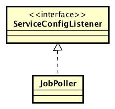

% **Code Inspection document - v1.0**
%Gianpaolo Branca
 Luca Butera
 Andrea Cini
%\newpage

#1 Introduction

##1.1 Purpose
The purpose of this document is to analyze two assigned classes which are part of a specific release of the Apache OFBiz Project, an open source software dedicated to the automation of enterprise processes. The analysis method that will be used is called Code Inspection and consists in a series of systematic verifications of the quality of the code based on a checklist. The aim of this analysis is two sided, first it helps the improvement of the code, providing to the developers a set of probable imperfections or errors in the code to be verified; but on the other side allows the inspector to deeply analyze the code becoming more and more skilled in finding possible mistakes even in the case he's the coder.

##1.2 Scope
Apache OFBiz is implemented using different standards, mainly Java, JEE and XML. The version assigned to us for inspection has been downloaded from the provide mirror and since the project was developed in Eclipse we used it to further lookup some points on the checklist through sonar.

#2 Classes

###2.1 PersistedServiceJob
__Namespace:__ org.apache.ofbiz.service.job  
__Extends:__ GenericServiceJob  
__Implements:__ N/A  

__Methods:__

###2.2 JobPoller
__Namespace:__ org.apache.ofbiz.service.job.JobPoller  
__Extends:__ N/A  
__Implements:__ org.apache.ofbiz.service.config.ServiceConfigListener  

__Methods:__  

* Line 59: getInstance()
* Line 63: createThreadPoolExecutor()
* Line 75: pollWaitTime()
* Line 91: registerJobManager(JobManager jm)
* Line 114: getPoolState()
* Line 145: onServiceConfigChange(ServiceConfig serviceConfig)
* Line 154: pollEnabled()
* Line 168: queueNow(Job job)
* Line 181: stop()

#3 Functional role
Note: The ofbiz project is very poorly documented and many aspect are not self explained.

###3.1 PersistedServiceJob

####Role
According to the Javadoc a __PersistedServiceJob__ is A Job that is backed by the entity engine, and his data are stored in the JobSandbox entity.  
The JobSandbox entity is an instance of GenericValue called JobValue, with a bad naming. Note that the class __JobSandbox__ does not exist in the entire project.

PersistedServiceJob extends __GenericServiceJob__, an async-service job and the main realization of a Job. Itself extend __AbstractServiceJob__, and this last implements the interface __Job__.  

According to the JavaDoc:  
A job starts out in the created state. When the job is queued for execution, it transitions to the queued state. While the job is executing it is in the running state. When the job execution ends, it transitions to the finished or failed state - depending on the outcome of the task that was performed.

A PersistedServiceJob works as a GenericServiceJob, it can be queued, dequeued, executed and finish, but every overrided method also store the time, the status and the result of the job in the __JobSandBox__ . It can also fail, but differently to its superclass it can retry a certain number of time, decided by the JobSandBox.  

####Usages
Importing the project with eclipse we managed to scan the entire project for the usages of this class.
It is used only once in the JobManager class, in the _poll(int)_ method, at line 225.
According to the documentation:  
this method scans the JobSandbox entity and returns a list of jobs that are due to run. Returns an empty list if there are no jobs due to run.
This method is called by the __JobPoller__ polling thread.    
A PersistedServiceJob is created whenever there is a job to run, added to the poll and returned to the JobPoller. The JobPoller class is explained in the next section.

###3.2 JobPoller

{#id .class width=50% height=50%}\

####Role
The JobPoller is a singleton class created to handle the execution of the Jobs contained into different JobManagers creating a queue that balances the Jobs execution ordering to ensure that the execution time is well spread among the JobManagers.

As one can see, the JobPoller relies on a ThreadPoolExecutor which is properly configured by taking information about the service configuration parameters from the ServiceConfigUtil class, this is achieved using the _createThreadPoolExecutor_ method.
The JobPoller, itself, contains an instance of an extension of the Thread class, which is the JobManagerPoller; this class is the main thread that manages the queueing of the Jobs, relying on the ThreadPoolExecutor.
The JobPoller also offers the access to informations about the Jobs he handles with the _getPoolState_ method, and also about the waiting time of the poll, with the _pollWaitTime_ method.
Along with these, the JobPoller contains a method to register a JobManager to the JobPoller, which of course is _registerJobManager_, this method clarifies the fact that the JobPoller operates as a "subscription service" and handles automatically only the execution of the Jobs related to subscripted JobManagers.
Furthermore one method allows the direct insertion of a Job into the ThreadPoolExecutor queue, the said method is _queueNow_.
In the end there's a method to enable the JobPoller and one to stop it.

Taken into account all these informations, it should result clear that the role of this class is the one stated at the beginning of this paragraph. The services offered by the JobPoller class, and the tasks that he carries out, clearly identify it as a manager created with the purpose of storing and organizing the Jobs and their execution along with relevant informations that can be retrieved upon necessity.

####Usages
The JobPoller class is used only by the JobManager class, to be specific in four different points in the code of the class, at lines 98, 109, 136, 367, following this order we'll explain the purpose of each usage case.
The first usage is in the _getInstance_ method which is basically used to retrieve a JobManager associated to a specific __Delegator__ or a new one if there's no existing. In the latter case a boolean value defines if the _registerJobManager_ method of the JobPoller must be called to perform the subscription of the newly created JobManager.
The second usage case is pretty straightforward, happens inside the _shutDown_ method, which is called upon the closing of OFBiz. This method calls the _getInstance_ method of the JobPoller and sequentially its _stop_ method which correctly shuts the JobPoller before proceeding to close the rest of the system.
The third usage case is also a pretty simple one, in fact it just involves the _getPoolState_ method which, after getting the JobPoller instance, calls its homonym method to retrieve the pool state Map to use as return value.
The fourth and last interaction instead is fairly interesting since it underlies one of the principal methods of the JobManager. The _runJob(Job)_ method is, in fact, used to directly insert a Job into execution queue, and relies on the _queueNow(Job)_ method of the JobPoller, which functionality has been already stated in the related Role paragraph.
 
#4 Issues list found by applying the checklist

##4.1 PersistedServiceJob

###Naming convention
* Constant variable _module_ should be all uppercase
* Method _longValue_ should start with a verb
* Method _verboseOn_ used at line 116 should start with a verb (hint: _isVerbose_)
* Method _nowTimestamp_ used at line 137 should start with a verb (hint: _getNowTimestamp_)
* Method _infoOn_ used at line 224 should start with a verb and has an ambiguous name
* Variable _next_ at line 179 should have a more meaningful name
* Variable _next_ at line 251 should have a more meaningful name
* Vaiable _jobValue_ at line 68 should be named _jobSandBox_ or similar, for consistency with comments, log outputs and javadoc.

###Indention
* Everything is ok

###Braces
* Single statement _if_ without braces at line 187
* Single statement _if_ without braces at line 191
* Single statement _if_ without braces at line 212

###File organization
* Line 83 can be rewritten with an if/else statement to not exceed 80 columns
* Line 114 exceed 120 columns
* Line 142 exceed 120 columns
* Line 153 exceed 120 columns
* Line 159 exceed 120 columns
* Line 187 exceed 120 columns
* Line 249 exceed 120 columns
* Line 259 exceed 120 columns
* Line 288 exceed 120 columns
* Line 323 exceed 120 columns

###Wrapping lines
* Everything ok

###Comments
* Everything ok

###Java source file
* Everything ok

###Package and import statements
* Everything ok

###Class and interface declaration
* Method _deQueue_ should be grouped with _queue_
* Method _init_ should be grouped with the other protected overridden methods

###Initialization and declaration
* _cancelTime_ not declared at the beginning of block at line 104 __?__
* _startTime_ not declared at the beginning of block at line 105 __?__
* _maxRecurrenceCount_ not declared at the beginning of block at line 148 __?__
* _currentRecurrenceCount_ not declared at the beginning of block at line 149 __?__
* _expr_ not declared at the beginning of block at line 150 __?__
* _recurrence_ not declared at the beginning of block at line 151 __?__
* _next_ not declared at the beginning of block at line 179
* _newJob_ not declared at the beginning of block at line 197
* _jobResult_ not declared at the beginning of block at line 222
* _next_ not declared at the beginning of block at line 251
* _count_ not declared at the beginning of block at line 321 __?__

###Method calls
* Everything ok

###Arrays
* Everything ok, no arrays

###Object comparison
* Everything ok

###Output format
* Everything ok

###Computation, Comparisons and Assignments
* Everything ok

###Exceptions
* Everything ok

###Flow of Control
* Everything ok, no switches and no loops

###Files
* Everything ok, no files

##JobPoller

###Naming convention
* Constant variable _module_ should be all uppercase
* Method _pollEnabled_ declared at line 154 should start with a verb
* Method _onServiceConfigChange_ declared at line 145 should start with a verb
* Method _remainingCapacity_ used at line 217 should start with a verb (hint: _getRemainingCapacity_)
* Method _values_ used at line 220 should start with a verb (hint: _getValues_)
* Method _infoOn_ used at line 224 should start with a verb and has an ambiguous name
* Method _iterator_ used at line 228 should start with a verb
* Variable _created_ at line 51 should have a more meaningful name

###Indention
* Line 67 starts with a mismatching number of spaces ?
* Line 71 starts with a mismatching number of spaces ?

###Braces
* Single statement _if_ without braces at line 224

###File organization
* Line 52 exceed 120 columns
* Line 67 exceed 120 columns
* Line 69 exceed 120 columns
* Line 71 exceed 120 columns
* Line 80 exceed 120 columns

###Wrapping lines
* Everything ok

###Comments
* Everything ok

###Java source file
* Everything ok

###Package and import statements
* Everything ok

###Class and interface declaration
* Variable _jobManagerPollerThread_ declared ad line 98 should be declared after the static variables
* Constructor _JobPoller_ at line 100 should be declared after the variables.

###Initialization and declaration
* _serviceName_ not declared at the beginning of block at line 131
* _queueCandidates_ not declared at the beginning of block at line 231 __?__
* _addingJobs_ not declared at the beginning of block at line 232 __?__

###Method calls
* Everything ok

###Arrays
* Everything ok

###Object comparison
* At line 213 "!=" is used instead of **!LEFT_PART.equals(RIGHT_PART)**.

###Output format
* Everything ok

###Computation, Comparisons and Assignments
* At line 191 the catch clause catches a general Exception instead of an InvalidJobException.  

###Exceptions
* Catch block at line 172 should log the exception.
* Catch block at line 192 contains no message for a generic Exception.
* Catch block at line 254 should log the exception.

###Flow of Control
* Everything ok, no switches

###Files
* Everything ok, no files

#Other problems
We managed to analyze the project with Sonarqube, founding the following extra issues:

* getLong(..) should return a long instead of a Long object.
* GenericValue class should have a more meaningful name, since it is used often in the inspected code for non trivial operation. According to the Javadoc it "Handles persistence for any defined entity". His name should reflect the offered functionalities.

##PersistedServiceJob
* “jobID” literal duplicated 4 times, should be replaced by a constant.
* “currentRecurrenceCount” literal duplicated 3 times, should be replaced by a constant.
* “currentRetryCount” literal duplicated 3 times, should be replaced by a constant.
* “runByInstanceID” literal duplicated 4 times, should be replaced by a constant.
* “statusId” literal duplicated 7 times, should be replaced by a constant.
* “startDateTime” literal duplicated 4 times, should be replaced by a constant.
* “parentJobId” literal duplicated 4 times, should be replaced by a constant.
* “startTime” variable at line 105 should be renamed since hides the field declared at line 69.
* Method init should be refactored since it have too high cognitive and cyclomatic complexity.
* “Long” constructor at line 206 should be removed.
* “Long” constructor at line 208 should be removed.
* Useless Assignment at line 222
* _if_ statement at line 309 always evaluated to false.

##JobPoller
* _pollWaitTime_ method should be moved into JobManagerPoller class
* Useless Assignment at line 125
* Method _newThread_ at line 200 should have the @Override notation
* Method _run_ at line 210 should have the @Override notation, and it should be refactored since it is too complex (it contains several if/for/while/switch/try statements nested).
* Nested _try_ block at line 245 should be extracted into a separate method

#Effort spent
