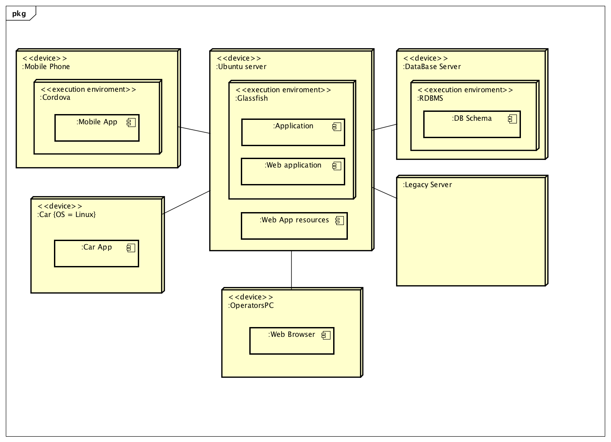
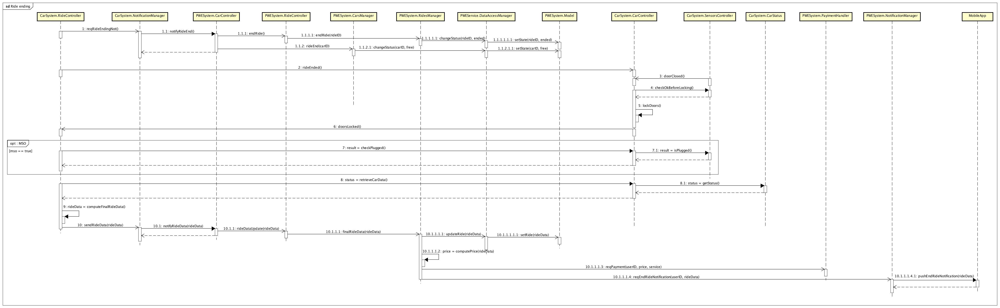
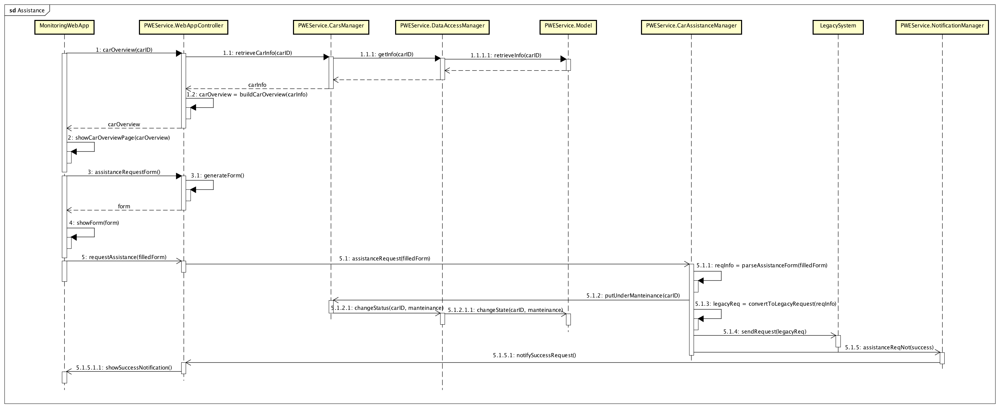
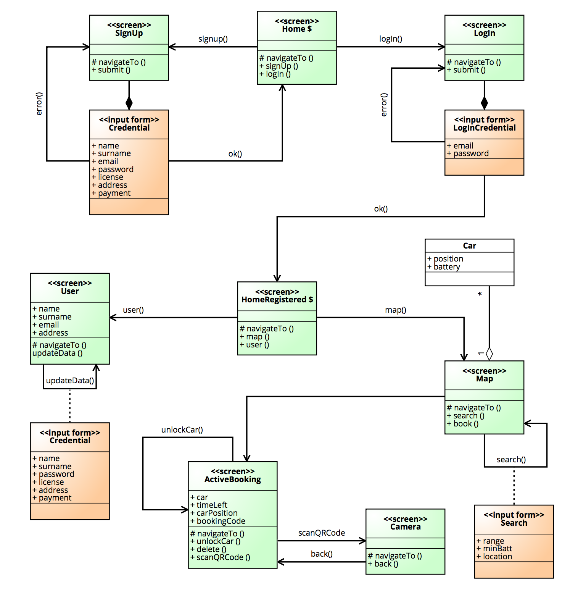
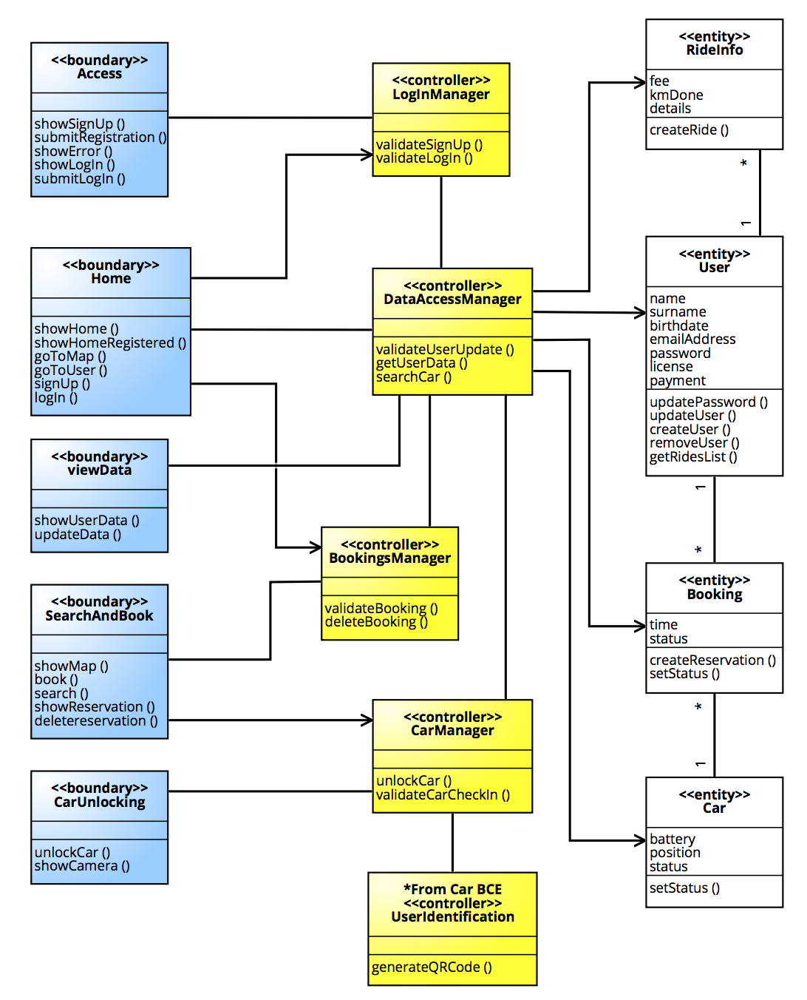

% **Design Document - v1.0**
%Gianpaolo Branca
 Luca Butera
 Andrea Cini
%\newpage

# 1 Introduction

## 1.1 Purpose
The purpose of this document is to describe in details how our system will be shaped, in which logical and physical units will be divided and which functionalities these units will provide and how.

## 1.2 Scope
With the analysis carried out in the RASD in mind, it appears that our system will have to deal with 3 major issues:

  * Provide a way for the final users to access the system and its services.
  * Provide the services.
  * Handle its resources(the cars) with care.

In other words:

  * Accessibility.
  * Service suppliance.
  * Control over the resources.

These points pretty much maps 1-to-1 with the three applications that we are going to develop:

  * A mobile application for the final users.
  * An on-board application for the cars.
  * A web application for the operators to monitor the status of the service.

## 1.3 Definitions, Acronyms, Abbreviations

* PWE: PoWer Enjoy.
* API: application programming interface, in this document we are mainly referring to web APIs that are pre-defined interfaces through which the client-server interaction happens.
* QR code: a matrix barcode.
* JEE : Java Enterprise Edition, a set of APIs and a runtime environment for developing and running enterprise software.
* RESTful: REpresentational State Transfer web services provide interoperability between computer systems on the net allowing the client-server interaction through a set of pre-defined stateless operations.
* JAX-RS: Java API for RESTful Services, the Java APIs for developing RESTful compliant applications, JAX-RS is part of the JEE framework.
* JDBC: Java DataBase Connection, a set of Java APIs which defines the interaction between a Java program and a DBMS JDBC compatible.
* DBMS: DataBase Management System, a software system to handle the creation, the manipulation and the retrieval of data in a database.
* JSON: JavaScript Object Notation, it's a lightweight format for data-interchange.
* RASD: Requirements Analysis and Specification Document.
* DD: Design Document.
* Legacy system: the already existing system of the company
* Ride: with ride we refer to the set of operations that begins with the user checking-in in the car and that ends with the user checking-out.
* TLS: Transport layer security, cryptographic protocol that grants security over a computer network.
* Adobe PhoneGap: a tool to develop mobile applications powered by web technologies. More information [_here_](http://phonegap.com).
* OBD: On-Board diagnostics, a system that provide access to the status of the various vehicle subsystems.
* Boundary Control Entity, BCE: diagrams that shows how user interface features are implemented in a MVC fashion.
* User Experience, UX: diagrams used for modeling the user interface.

## 1.4 Reference documents

* RASD
* Specification document
* DD example provided on Beep.
\newpage

# 2 Architectural Design

## 2.1 Overview

We are going to build our system following these guidelines (appropriate reasons for each choice will be given in the next sections):

1. Our system will be implemented using a three-tier architecture for each application, as it is the most suitable(this point will be clear in the next steps) and maintainable one for our system.

2. For the mobile application the client side will be light-weighted, with only the presentation layer as there's no need to perform any kind of data manipulation on the user's mobile phone.

3. The car will be equipped with a machine with our application running on it. On the contrary of the mobile app case, the on-board application will need to exploit some logic to perform its functionalities.

4. The operators will access the system through a web application from the company internal network.

5. Integration with the legacy server will happen trough its APIs for the purpose of providing effective maintenance to the cars.

6. Firewalls will keep secure the communications with the mobile clients and the cars.

Refer to the Architectural and technological choices for a more in depth analysis of these points.

{#id .class width=100% height=100%}\
{#id .class width=100% height=100%}\

## 2.2 High level component view

In this section we are going to give a look at the architectural structure of our system at the level of the components that we are going to develop and the main ones that we are going to interact with. \newline

{#id .class width=100% height=100%}\

Components to be developed:

* **PWEService**: It is the core of the system, it has a role of services provider and tasks coordinator. The core of the logic aimed to fulfill our business goals is implemented here.
* **CarSystem**: The component representing the on-board application of the car, its main functionalities are the ones related to the handling of a ride and the monitoring of the car status. It also offers presentation functionalities to give(receive) feedback to(from) the client. It expose its own interface to grant the central component control over its functionalities and uses a dedicated PWEInterface to ask for the server services and to send updates.
* **MobileApp**: The component providing the client the access to the system. It fulfills only presentation functions. It behaves like an asynchronous client and interacts with the central component through the ServiceAPIs in classic client-server fashion.
* **MonitoringWebApp**: The component providing operators of the company access to monitoring and configuration functionalities. It has only presentation functionalities(web pages) and communicates with the central component through the provided interface.

Components to be integrated in the system:

* **LegacySystem**: The already existing system of the company, our system will exploit its functionalities through the provided APIs.
* **DBMS**: The system that will take care of the management of our data, integrated in our system using a specific driver.
* **GoogleMaps and PayPal**: Respectively the provider of the maps and the payment service(they are not in the diagram, their integration in the system will be discussed later on).

## 2.3 Component view

#### Car System

{#id .class width=100% height=100%}\

Components description:

* **CarController** : The main controller of the car. It retrieves informations from the other components, executes the requests of the server and updates the car status.
* **RideController** : The handler of the operations concerning the execution of a ride. It communicates with the central component which has its own control functionalities over the ride: after the users have been identified the ride controller creates the ride instance, communicates the initial details on the ride to the central system (e.g. the number of passengers) and then goes on sending updates periodically or when the ride status change (e.g. the car exits the city boundaries). Further details will be given in the runtime view.
* **UserIdentification** : The component that will handle the identification of the users that check-in at the start of the ride.
* **Navigation Controller** : The component that will provide navigation utilities using the GoogleMaps APIs and the GPS.
* **GPSManager** : The component that will handle GPS localization of the car.
* **CarStatus** : An internal representation of the status of the car.
* **SensorsController**: The component that handles the retrieval of information from the sensors thought the OBD interface.
* **NotificationManager**: The component that handles notifications coming from the central component and that performs the sending of the outgoing ones.
* **ViewControlLer**: The component that handles the update of the GUI and the retrieval of the user input through the interface.
* **GUI**: Implementation of the presentation layer of the car application. \newpage

#### PWEService and Model

{#id .class width=100% height=100%}\

{#id .class width=100% height=100%}\

Components description:

* **RequestDispatcher**: The component handles the requests from the mobile application clients using the interfaces provided by the internal components.
* **BookingManager**: The component that handles the operations concerning the usage of a car.
* **RideController**: It interacts with the RideController component in the car  as already mentioned in the section above the way the two components interact with each other will be clarified in the Runtime View section. It is a multi-instance component.
* **RidesManager**: The component that handles the set of rides that are ongoing in the system, it interacts with the other components to give the single RideController access to the functionalities that it needs.
* **CarController**: It interacts with the CarController component in the single car to offer services and perform supervising functionalities over a single vehicle. It is a multi-instance component.
* **CarsManager**: The component the supervises the set of all the cars available in the system interacting with the single CarController and providing operators with informations about the cars status and a way to change the status itself.
*  **LoginManager**: The component that handles the log-in of operators and users.
*  **PaymentHandler**: The component that handles the payment operations and makes sure that users unable to pay are correctly banned until they pay. It uses the PayPal APIs to process the payments.
* **PayPal**: The payment handler of choice for our system.
* **LegacySystem**: The old system of the company, our system uses its APIs to send assistance where needed.
* **CarAssistanceManager**: The component that offers the functionalities needed to provide assistance to the vehicles when they need to be moved, recharged or repaired. It exploits the functionalities of the legacy system to send road-operators to the car location.
* **WebAppController**: The component that makes the system functionalities accessible from the WebApplication.
* **Configurator**: The component that offers the configuration functionalities to customize a set of parameters of the system (set of SafeAreas, fares, fees and so on).
* **NotificationController**: The component that offers notification functionalities towards the various components of the system.
* **Model**: The structure of the data in our system (specified in a distinct diagram).
* **GoogleMaps**: Provider of the maps services.

## 2.4 Requirements Traceability

In this section we will show how the components of our system are designed to satisfy the requirements and goals specified in the RASD. For utility we report the goals and requirements here too.

### Goals

The system must:

- [G0] Make the user able to access to the system.
- [G1] Allow the clients to find an available car within a selected radius around his or a specified location.
- [G2] Allow the clients to book a car and pick it up.
- [G3] Monitor the usage of the car and charge the client with the right fare.
- [G4] Incentivize a correct usage of the service to allow as many as possible users to use the same car without the need of the service of an operator.
- [G5] Ensure a correct distribution of cars in the recharging stations according to the available plugs.
- [G6] Allow operators to manage and monitor the state of all the cars and notify them when maintenance is needed on a specific vehicle.
- [G7] Allow management system to set up and modify parameters of the system.
- [G8] Provide a real time, interactive, pleasant and transparent user experience.

### Functional Requirements

In the following section we are going to identify the requirements that our system will have to fulfill to reach the goals.

- [G0] Make the user able to access to the system.

    - [R0.1] A user must sign up with valid credential.
    - [R0.2] The system must generate a password for the user and send it to him through e-mail.
    - [R0.3] A user must be able to visualize and modify all his personal informations.

- [G1] Allow the clients to find an available car within a selected radius around his or a specified location.

    - [R1.1] The system must be able to retrieve the location of the user.
    - [R1.2] The user must be able to scroll the map of the city to find a car or specify the radius (in km) around a selected location for the car research.
    - [R1.3] Upon the selection of a car the system must show an informative screen with current car details.

- [G2] Allow the clients to book a car and pick it up.

    - [R2.1] A client must be able to choose one of the available cars and book it.
    - [R2.2] Once a car has been booked no others reservation can be performed by the same client until the first one is pending.
    - [R2.3] After the reservation has been confirmed to the client, he has a maximum of 1 hour to reach the car, unlock it and start the engine. If the timeout expires the reservation is cancelled and a fee is applied.
    - [R2.4] The user is able to unlock a booked car trough the app at any time after the reservation, however he has a maximum of 15 minutes to turn it on after the unlocking. If this timeout expires, the reservation is cancelled the fee is applied.
    - [R2.5] The user in order and start the car has to check-in scanning a QR code in the car display and then press the physical start button.

- [G3] Monitor the usage of the car and charge the client with the right fare.

    - [R3.1] As soon as the engine starts the system must start charging the user with a fixed amount for minute and show the current price of the ride in the display of the car.
    - [R3.2] When a car is parked in a safe area and the engine is turned off, the system will ask the user through the car display if he wants to keep the car busy for at maximum 2h, if the user selects 'NO' or does nothing and leaves the car, the ride is considered as ended. If the user selects 'YES' the car is marked as busy.
    - [R3.3] An user can leave the car he's using and keep it busy with a time limit of 2 hours. During this time, since the battery is not being used, the management may configure a different fare. When the timeout expires if the car hasn't been picked up yet the client will be charged with the price of the ride up to that point.
    - [R3.4] A car parked in a place not marked as safe will be considered as busy, but if the client breaks the 2 hours timeout he will get a fine for improper use of the service (plus the regular price for the ride). The situation will be notified to the operators that will be able to choose if the car needs to be moved or not.
    - [R3.5] If the user drives outside the boundaries of the area of the service, the system must detect it, notify it to the user a and apply an additional time fare as a penalty. After 30 minutes an operator will be notified of the situation.
    - [R3.6] If the signal of a car is lost for more than 10 minutes, an operator will be notified with the last known position.
    - [R3.7] 5 minutes after the end of the ride the user is charged with the right amount and a push notification will be delivered on the user's mobile phone. The five minutes delay is necessary to give the client the possibility to eventually plug the car and get the corresponding discount.
    - [R3.8] If a user is unable to pay for a ride he will be banned from the system until the pending payment will be satisfied.

- [G4] Incentivize a correct usage of the service to allow as many as possible users to use the same car without the need of the service of an operator.(Note that discounts and penalties will not be applied to short rides, further details in Text Assumption n.1)

    - [R4.1] The system will show in the car display a QR code that must be scanned by the user, using the application, to check in. If 2 or more users check in, in addition to the driver, a discount will be applied to the ride.
    - [R4.2]  The system will apply a discount in the case that a car is left with more the 50% of the battery capacity available.
    - [R4.3] The system will detect when a car is left plugged in a recharging station at the end of a ride (using the GPS sensor and the informations sent to the system by the station) and will apply a discount . If the car is left in the recharging station but not plugged within 5 minutes the discount will not be applied.
    - [R4.4] The system will detect when a car is about to be left more than 3km away from the nearest recharging station and with 20% or less battery available, will warn the client and if the client proceeds to leave the car will apply a penalty to the price of the ride.
    - [R4.5] The client will be able to select a money saving option so that the system will provide him, trough the GPS navigator of the car, informations to reach the available recharging station which is more suitable according to the client destination and the need of the system to distribute car uniformly among the recharging stations.
    - [R4.6] The user will get only the higher discount between the ones of which at [R4.2] and [R4.3], eventually cumulated with the one stated at [R4.1], however the system will keep track of all the discounts applicable of a certain ride, then a procedure will calculate the final price according to this policy.

- [G5] Ensure a correct distribution of cars in the recharging stations according to the available plugs.

    - [R5.1] The system will help operators and the users with the money saving option on to choose the station in which cars should be recharged and left so that cars are reasonably distributed among the different stations in the city.
    - [R5.2] The amount of plugs available in a certain station must be monitored and the presence of non working ones detected.

- [G6] Allow operators to manage and monitor the state of all the cars and notify them when maintenance is needed on a specific vehicle.

    - [R6.1] The system will provide operators of the company with an interface to check the state of the cars.
    - [R6.2] Push notifications will notify when a car is need for assistance.
    - [R6.3] Cars with low battery level which are not likely to be used anymore will be flagged.
    - [R6.4] The system must interact with the old system to effectively ensure maintenance to the cars.

- [G7] Allow management system to set up and modify parameters of the system.

    - [R7.1] The system will provide an interface to select areas to mark as safe for parking. The selection of the locations will be possible specifying the boundaries of the areas using a map or a radius around an address.
    - [R7.2] The system will provide an interface to select the price for minute of the rides and during the busy state.
    - [R7.3] The system will provide and interface to customize fees and the percentage of discount and penalty for the cases highlighted in the [G.4] scope.

- [G8] Provide a real time, interactive, pleasant and transparent user experience.

    - [R8.1] After the end of each ride the system must notify the user with all the informations concerning the last usage, among which the total amount of money charged and details about eventual discounts or penalties.
    - [R8.2] If at the beginning of a ride the client is suitable for the discount of which at [R4.1], the system will notify it with an on screen notification.
    - [R8.3] At the end of a ride, if the user results parked inside a charging station, the system reminds him to insert the plug in the specific socket to get the discount of which at [R4.4] using an on screen notification.
    - [R8.4] The system eventually notifies the user with every update regarding the service, including changes in the terms and conditions document which will always have to be accepted again.

### Non-functional Requirements

 - [NFR1]The mobile application must work on all the android devices with version 4.3 or higher and iOS 7 or higher.
 - [NFR2]The system must optimize bandwidth usage to guarantee a responsive service and to detect the position of a car real time.
 - [NFR3]For communication, secure protocols must be used.

### Traceability

The following pictures show which components are involved in the fulfillment of each requirements group (each group corresponding to a goal). Note that to keep the diagram simple some component is not linked to any group of requirement, but it's obvious that they fulfill the same requirements of the components the makes of of them (e.g. a CarController is used to fulfill almost the same requirements of the CarsManager).

{#id .class width=100% height=100%}\

{#id .class width=100% height=100%}\

How we are going to meet the non-functional requirements will be clarified in the architectural choices, but in general:

  * [NFR1] We will use Adobe PhoneGap to develop a multi-platform application.
  * [NFR2] We will use efficient communication protocols and lightweight data formats.
  * [NFR3] Usage of firewalls(as mentioned before) and TLS.

## 2.5 Architectural and technological choices

{#id .class width=100% height=100%}\

### Server-side (Web , Business Logic and Data tiers)

* We will develop our application and web server using the Java EnterpriseEdition framework (formally, using JEE, we should refer to our application as multi-tier, but for simplicity sake and because our system is distributed over client machines, JEE server machine and a database we will consider it three-tier) .

    - JEE will allow us to shorten the development time and to achieve high performances while keeping our application complexity manageable.
    - JEE makes our project use architectural structure that follows well-known best practices.

* We will use Oracle GlassFish Server (the commercial edition) as application server.

    - GlassFish gives very good performance guarantees and is well supported.

* We will use the JAX-RS APIs to expose RESTful APIs with JSON that will be used from the mobile app to interface with the web server.

    - The usage of the RESTful standard will give our system robustness and flexibility.
    - This will allow us to use Adobe PhoneGap to develop an hybrid multi-platform application for the client side.
    - The usage of JSON helps with optimizing the usage of bandwidth.

* We will use the MySQL to manage our Database.

    - We don't need advanced feature for data management that other DBMSs offer.
    - MySQL is fast and easy to use.
    - Free.
    - Compatible with JDBC.

  * TLS will be used for confidential information communication. \newline

### Client-side

#### Mobile application

* We will develop our application using the standard web technologies (AngularJS, HTML, css) and use Adobe PhoneGap (built on Apache Cordova) to create a multi-platform mobile app. This approach will allow us to:

  - Benefit from the experience of our engineers in web development.
  - Reduce development time and cost.\newline

{#id .class width=100% height=100%}\

#### Monitoring WebApp

* We will develop the monitoring Web using a JEE web server exploiting the JavaServlet framework.
    - Easy to deploy and develop.\newline

{#id .class width=100% height=100%}\

#### Car on-board application

* We will develop a Java application to run in the system of the car.

  - We need a tool to have control over the car status.
  - The application needs to contain not only presentation features, but also logic to elaborate the data coming from the sensors and manage the execution of a ride without a continuos interaction with the server and deal with real time issues.
  - The application will be able to retrieve informations from the car sensors (such as the battery level or the presence of mechanical problems)through OBD connector(Java libraries to read information from an OBD adapter already exist).
* For the communication with the server a RemoteProcedureCall approach will be used.
    - Well supported by JEE.
    - It's intuitive and practical to represent cars as remote objects.

{#id .class width=100% height=100%}\

## 2.6 Patterns

These are the main design patterns that we are following in the design process and many of those are good practices imposed by the adoption of the JEE framework.

* Model-Control-View : used for almost every component of the system. It's a really good choice of design that allows to keep very clear the role of every component of the system and that makes the system easier to deploy and maintain.
* Client-server : the staple good practice of a web based system.

## 2.7 Deployment view
This diagram purpose is to show the hardware components of our system and where the code is going to run.\newline

{#id .class width=100% height=100%}\

\newpage

## 2.8 Runtime view

In this section are the runtime diagrams which aim is to give a more detailed view of the communication among the various components of our system during different phases of it's usage.
The runtime diagrams are coherent with the component diagrams even though in some points, for the sake of simplicity, some communications which refer just to message forwarding or data retrieval are omitted or condensed into one, technically not existing, direct communication.
Also is important to underline that the technologies used for communication among different components are previously stated in this document and the messages containing sensible data are encrypted via TLS.

#### Diagrams URLs

Since runtime diagrams, especially the ones referring to the ride, are rather big, here are provided the URLs to download the PNG files directly, in order to have a better look on the diagrams themselves.

* User logs in:
 [_here_](https://github.com/GianpaoloBranca/SoftwareEng2/raw/master/scratches/DD/runtime_diagrams/login_runtime.png)
* User books a car:
 [_here_](https://github.com/GianpaoloBranca/SoftwareEng2/raw/master/scratches/DD/runtime_diagrams/booking_runtime.png)
* User starts a ride:
 [_here_](https://github.com/GianpaoloBranca/SoftwareEng2/raw/master/scratches/DD/runtime_diagrams/ride_start_runtime.png)
* User uses the navigator with money saving option:
 [_here_](https://github.com/GianpaoloBranca/SoftwareEng2/raw/master/scratches/DD/runtime_diagrams/navigation_runtime.png)
* User ends a ride:
 [_here_](https://github.com/GianpaoloBranca/SoftwareEng2/raw/master/scratches/DD/runtime_diagrams/ride_ending_runtime.png)
* Operator enrolls an assistance request:
 [_here_](https://github.com/GianpaoloBranca/SoftwareEng2/raw/master/scratches/DD/runtime_diagrams/assistance_runtime.png)

\newpage

### User logs in

{#id .class width=100% height=100%}\

In this runtime diagrams we see the login process for an already registered user point of view. The login credentials are sent from the MobileApp to the RequestDispatcher which forwards the request to the LoginManager which checks the ID-password couple against the Model. In case of wrong credentials an error is sent back to the application. If credentials are correct then a token is generated, associated to the user and sent back to the MobileApp. This token will remain in the cache of the application and will be used to send future messages to the server without the need of further authentications.

### User books a car

{#id .class width=100% height=100%}\

In this diagram the car booking process is shown. The car search request is sent, via RequestDispatcher, form the MobileApp to the BookingManager which, retrieving datas from the Model and from GoogleMaps, builds a response for the MobileApp. The MobileApp uses the response to show a view of the city map with cars inside the requested area. When the car is selected informations are sent in the same way to the BookingManager which checks if the car is in fact available, if it is then the car status is changed and the new Booking instance is generated.

### User starts a ride

{#id .class width=100% height=100%}\

This diagram show the beginning of a ride from the moment in which the user unlocks the car door to the moment the ride instance is generated and the car status is updated. In between are described all processes concerning control of timeouts after the user unlocks the car and check-in process. It is voluntary omitted the case of passengers check-in since it works the same way as the driver check-in and is not the central point of the diagram.

### User uses the navigator with money saving option

{#id .class width=100% height=100%}\

In this diagram we show the process behind the usage of the car navigator, even considering the MoneySavingOption. The ViewControlLer communicates to the NavigationController the request for the GPS navigation towards a certain destination. The NavigationController retrieves informations from the GPSManager and GoogleMaps components to build the navigation data which are sent back to the ViewControlLer that is in charge of creating the visual representation on the car display through the GUI component. Then there is a looping process of updating until the required destination is reached.

### User ends a ride

{#id .class width=100% height=100%}\

The previous diagram shows the process of ending a ride. First the RideController inside the CarSystem notifies the specific components inside the PWESystem that the ride ended and then those components take charge to change the car and the ride status inside the Model. After that the CarController is notified when the car doors gets closed, at this point it performs a series of checks and, if everything is ok, it proceeds to lock the car. After 15 minutes, if MoneySavingOption was selected, the RideController checks if the car is plugged, then retrieves car datas and computes final datas about the ride. In the end those datas are sent to the server where the RidesManager updates the ride status to "ended", enrolls the payment request and sends a final notification to the user's MobileApp.

### Operator enrolls an assistance request

{#id .class width=100% height=100%}\

In this runtime diagram the operator sends, through the MonitoringWebApp, a request for a car overview. The request is handled by the WebAppController which asks the CarsManager for infos about the specified car. When the infos are retrieved from the Model and sent back to it, the WebAppController builds the view informations and send them back to the MonitoringWebApp. At this point the WebApp requests the assistance request form which is provided by the previously stated WebAppController. Then, through the same way, the compiled form is sent to the CarAssistanceManager, this component then interacts with the CarsManager to change the car status to "maintenance", and with the LegacySystem to send the request to the proper facility. Is important to underline that the CarAssistanceManager translates the request into one that is compatible with the old system. After that the CarAssistanceManager uses the NotificationManager to inform the MonitoringWebApp of the success of the operation.

## 2.9 Component Interfaces

This diagram shows the most relevant parts of the interfaces that our system is going to use for communication between the various components. The ServiceAPIs is the main interface used by the MobileApp, it exposes methods to perform the principal interactions with the PWESystem and to retrieve informations about service usage history. This interface uses, through the RequestDispatcher, the other interfaces that are present inside the PWESystem, the 1-1 correspondence between the methods is rather intuitive and also further explained in the runtime view of the system.
WebAppController interface contains all the functions the MonitoringWebApp requires to satisfy the goals of our monitoring system, from login and car supervision to system parameters modification.
In the end CarAppServer and CarInterface are interfaces used for communication between the CarSystem and the PWESystem, they both contain the methods for communication during the main events that our system handles, further expansion of those interfaces is expectable as the developing process goes on.

{#id .class width=100% height=100%}\
\newpage

# 3 Algorithm design

This first algorithm uses ride informations contained in the model to compute the price the user has to pay. It keeps into account the time spent by the user in the various phases of the service usage and also the price variations to be applied.

\begin{lstlisting}
float computePrice(Ride ride) {

  float price = 0;
  boolean badB=false;

  price += Fares.getStandardFare() * ride.getDriveTime()
           + Fares.getParkedFare() * ride.getBusyTime;

  if(ride.getTimeOutsideBoundary>0){
    badB = true;
    price += Fares.getOutsideCityFare() * ride.getTimeOutsideBoundary;
  }

  switch (ride.getEndType()){
    case LEGAL : break;
    case LEFT_PARKED : price += Fares.getLeftParkedFee();
                      badB = true;
                      break;
    case END_OUTSIDE_CITY : price += Fares.getLeftOutsideCityFee();
                            badB = true;
                            break;
    default : break;
  }

  price -= price*computeDiscount(ride,badB);
  return price;
}
\end{lstlisting}

\newpage

\begin{lstlisting}
float computeDiscount(Ride ride, boolean badB){
  float discount = 0;
  Coord endPos = ride.getEndPosition();
  if(!badB){
    if(ride.getPassengerNumber() >= 2) {
      discount += PriceVariation.getPassengerDiscount();
    }

    //the following two options are alternatives
    if(ride.getEndWithCharge) {
      discount += PriceVariation.getEndWithChargeDiscount();
      return discount;
    }
    if(ride.getEndBatteryLevel() > 0.5) {
      discount += PriceVariation.getHighBatteryDiscount();
      return discount;
  	}
 }
 if(ride.getEndBatteryLevel() < 0.2 && GMaps.dist(endPos, getNearestRecharginStation(1, endPos).get(0).getCoord()) > 3.0)) {
   //if the distance between the nearest station and the car  is more than 3.0km
   discount += PriceVariation.getLowBatteryMalus();
 }
 return discount;	 	
}
\end{lstlisting}

\newpage

This algorithm calculates the best proposal for a user that wants to use the MoneySavingOption. It binds a weight to each station that considers not only the proximity to the destination but also the number of available plugs, that is to keep a good distribution of the cars among the city. If there's no reasonable choice the algorithm return an error coordinate.

\begin{lstlisting}

// returns the list of the n stations no farther than distance from destination
List<Station> getNearestRechargingStations(int n, float distance , Coord destination);

Coord computeMoneySavingStation(Coord destination) {

  List<Station> selectedStations = getNearestRechargingStations(Utility.N_OF_STATIONS, Utility.ACCEPTABLE_DISTANCE,destination);

  float maxWeight = -1;  
  int selectedIndex;

  if(selectedStations.isEmpty()){
    return new Coord(ERROR);
  }
  for(Station n : selectedStations){
    if(n.computeWeight(destination) > maxWeight){
      maxWeight = computeWeight(n , destination);
      selectedIndex = selectedStations.getIndexOf(n);
    }
  }
  return selectedStations.get(selectedIndex).getCoord();
}

float computeWeight(Station station, Coord point){
  return (station.plugsAvailable/GMaps.dist(point, station.coordinates))
}

\end{lstlisting}

\newpage

# 4 User Interface design

In the following sections we will provide an insight of the user interface design with UX and BCE diagrams. GUI mockups already have been already provided in the RASD.

## 4.1 User Experience diagrams

These diagrams show how users will interact with the system.

### Mobile application

{#id .class width=100% height=100%}\

### Car application

{#id .class width=100% height=100%}\

### Operators application

{#id .class width=100% height=100%}\

## 4.2 Boundary Entity Control diagrams

These diagrams are here to show how each action is performed by the system. The entities representation is simplified to show only the relevant parts. There is not a 1-to-1 correspondence of the elements of these diagrams with the components in the component diagrams because the level of focus is different.

### Mobile application

{#id .class width=100% height=100%}\

### Car application

{#id .class width=100% height=100%}\

### Operators application

{#id .class width=100% height=100%}\

# 5 Tools

- Atom (with MarkDown Preview Plus package) for writing Pandoc MarkDown with syntax highlighting and the preview features.
- Pandoc to craft the pdf from the MarkDown document.
- Signavio for the user interface related diagrams.
- Astah for the other diagrams.

# 6 Effort spent

* Andrea Cini : 35h
