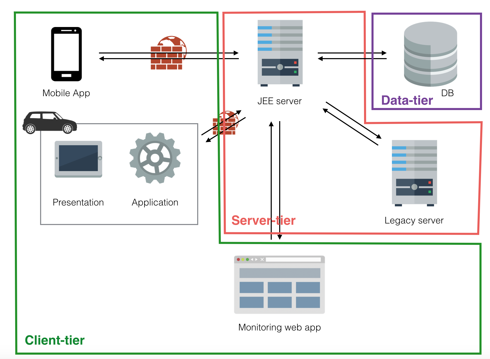
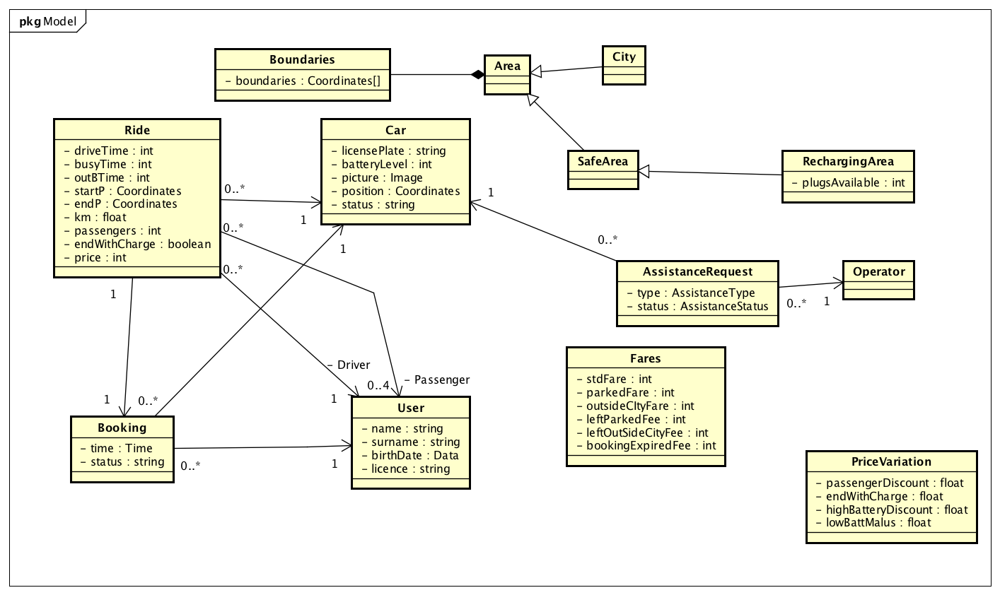

% **Design Document - v1.0**
%Gianpaolo Branca
 Luca Butera
 Andrea Cini \newline
%\newpage

\newpage

#Introduction

##Purpose
The purpose of this document is to provide technical informations about the service we are going to deploy described in the RASD.

##Scope
Our service is about electric car sharing to provide a valid option to public transportation for low length trips.
It is provided via mobile application for the final users and via web application for the operators of the company.
Users can download the app with the Android play store or with the Apple store. Operators can enter the system directly from a browser in the boundaries of the companies network after logging in.

##Definitions, Acronyms, Abbreviations

* PWE: PoWer Enjoy.
* API: application programming interface, in this document we are mainly referring to web APIs that are defined interfaces through which the client-server interaction happens.
* QR code: a matrix barcode.
* JEE : Java Enterprise Edition, a set of APIs and a runtime environment for developing and running enterprise software.
* RESTful: REpresentational State Transfer web services provide interoperability between computer systems on the net allowing the client-server interaction through a set of pre-defined stateless operations.
* JAX-RS: Java API for RESTful Services, the Java APIs for developing RESTful compliant applications, JAX-RS is part of the JEE framework.
* JDBC: Java DataBase Connection, a set of Java APIs which defines the interaction between a Java program and a DBMS JDBC compatible.
* DBMS: DataBase Management System, a software system to handle the creation, the manipulation and the retrieval of data in a database.
* JSON: JavaScript Object Notation, it's a lightweight format for data-interchange.
* RASD: Requirements Analysis and Specification Document.
* DD: Design Document.
* Controller
* Legacy system
* Ride

##Reference documents

* RASD
* Specification document

# Architectural Design

## Overview

We are going to build our system following these guidelines (appropriate reasons for each choice will be given in the next section):

1. Our application will be implemented using a three-tier architecture as it is the most suitable(this point will be clear in the next steps) and maintainable one for our system.

2. For the mobile application the client side will be light-weighted, with only the presentation layer as there's no need to perform any kind of data manipulation on the user's mobile phone.

3. The car will be equipped with a machine with our application running on it, it will also implement some logic.

4. The operators will access the system through a web application.

5. Integration with the legacy server will happen trough its APIs for the purpose of providing maintenance to the cars and clients care.

## Architectural choices

### Server-side (Web , Business Logic and Data tiers)

* We will develop our application and web server using the Java EnterpriseEdition framework (formally, using JEE, we should refer to our application as multi-tier, but for simplicity sake and because our system is distributed over client machines, JEE server machine and a database we will consider it three-tier) .

    - JEE will allow us to shorten the development time and to achieve high performances while keeping our application complexity manageable.
    - JEE makes our project use architectural structure that follows well-known best practices.

* We will use Oracle GlassFish Server (the commercial edition) as application server.

    - GlassFish gives very good performance guarantees and is well supported.

* We will use the JAX-RS APIs to expose RESTful APIs with JSON that will be used client-side to interface with the web server.

    - The usage of the RESTful standard will give our system robustness and flexibility.
    - This will allow us to use Adobe PhoneGap to develop an hybrid multi-platform application for the client side.

* We will use the MySQL to manage our Database.

    - We don't need advanced feature for data management that other DBMSs offer.
    - MySQL is fast and easy to use.
    - Free.
    - Compatible with JDBC.\newline
{#id .class width=100% height=100%}

### Client-side

#### Mobile application

* We will develop our application using the standard web technologies (AngularJS, HTML, css) and use Adobe PhoneGap (built on Apache Cordova) to create a multi-platform mobile app. This approach will allow us to:

  - Benefit from the experience of our engineers in web development.
  - Reduce development time and cost.\newline
{#id .class width=100% height=100%}

#### Monitoring WebApp

* We will develop the monitoring Web using a JavaServlet.

  - Easy to deploy.
  - Integrated in the JEE framework.\newline
{#id .class width=100% height=100%}

#### Car on-board application

* We will develop a Java application to run in the system of the car.

  - We need a tool to have control over the car status.
  - The application needs to contain not only presentation features, but also logic to elaborate the data coming from the sensors and manage the execution of a ride without a continuos interaction with the server and deal with real time issues.
  - The application will be able to retrieve informations from the car sensors (such as the battery level or the presence of mechanical problems)through OBD connector(Java libraries to read information from an OBD adapter already exist).\newline
  {#id .class width=100% height=100%}

## High level component view

In this section we are going to give a look at the architectural structure of our system at the level of the components that we are going to develop and the main ones that we are going to interact with. \newline

{#id .class width=100% height=100%}

Components to be developed:

* **PWEService**: It is the core of the system, it has a role of services provider and tasks coordinator. The core of the logic aimed to fulfill our business goals is implemented here.
* **CarSystem**: The component representing the on-board application of the car, its main functionalities are the ones related to the handling of a ride and the monitoring of the car status. It also offers presentation functionalities to give(receive) feedback to(from) the client. It expose its own interface to grant the central component control over its functionalities and uses a dedicated PWEInterface to ask for the server services and to send updates.
* **MobileApp***: The component providing the client the access to the system. It fulfills only presentation functions. It behaves like a synchronous client and interacts with the central component through the ServiceAPIs in a call/response, classic client-server fashion.
* **MonitoringWebApp**: The component providing operators of the company access to monitoring functionalities. It has only presentation functionalities(web pages) and communicates with the central component through the provided interface.

Components to be integrated in the system:

* **LegacySystem**: the already existing system of the company, our system will exploit its functionalities through the provided APIs.
* **DBMS**: the system that will take care of the management of our data, integrated in our system using a specific driver.
* **GoogleMaps and PayPal**: respectively the provider of the maps and the payment service(they are not in the diagram, their integration in the system will be discussed later on).

## Component view

#### Car System

{#id .class width=100% height=100%}

* **CarController** : The main controller of the car. It retrieves informations from the other components, executes the requests of the server and updates the car status.
* **RideController** : The handler of the operations concerning the execution of a ride. It communicates with the central component which has its own control functionalities over the ride: after the users have been identified the ride controller creates the ride instance, communicates the initial details on the ride to the central system (e.g. the number of passengers) and then goes on sending updates periodically or when the ride status change (e.g. the car exits the city boundaries), further details will be given in the runtime view.
* **UserIdentification** : The component that will handle the identification of the users that check-in at the start of the ride.
* **Navigation Controller** : The component that will provide navigation utilities using the GoogleMaps APIs and the GPS.
* **GPSManager** : The component that will handle GPS localization of the car.
* **CarStatus** : An internal representation of the status of the car.
* **SensorsController**: The component that handles the retrieval of information from the sensors thought the OBD interface.
* **NotificationManager**: The component that handles notifications coming from the central component and that perform the sending of the outgoing ones.
* **ViewControlLer**: The component that handles the update of the GUI and the retrieval of the user input through the interface.
* **GUI**: Implementation of the presentation layer of the car application.

### PWEService

{#id .class width=100% height=100%}

{#id .class width=100% height=100%}

## Deployment view

## Runtime view

## Component Interfaces

## Selected architectural styles and pattern

These are the main design patterns that we are following in the design process:

* Model-Control-View : used pretty much everywhere, it's a really good choice of design that allow to keep very clear the role of every component of the system and that makes the system easy to deploy and maintain.
* Client-server : the staple good practice of a web based system.

## Other design decisions

# Algorithm design

# User Interface design

# Requirements Traceability

# Effort spent
