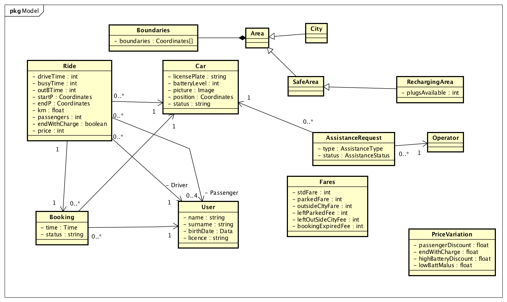
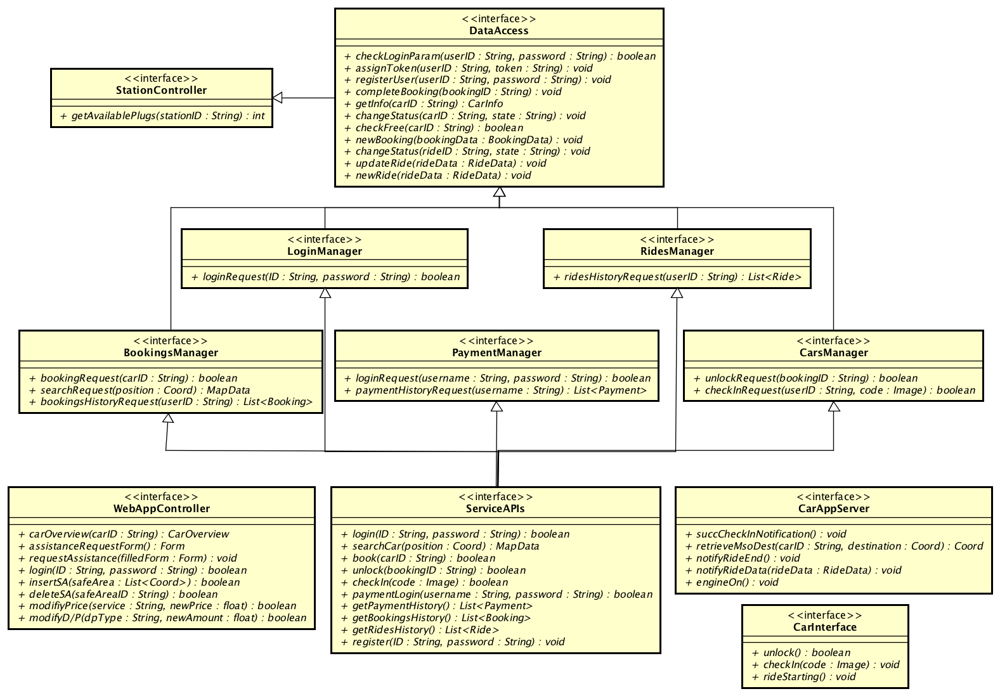

% **Project Plan Document - v1.0**
%Gianpaolo Branca
 Luca Butera
 Andrea Cini
%\newpage

\newpage

---
header-includes:
    - \usepackage{placeins}
    - \usepackage{float}
---
#1 Introduction

## 1.1 Purpose and Scope

## 1.2 Definitions, Acronyms, Abbreviations

* Data element type (DET): a unique user recognizable, non recursive, field.
* Record element type (RET): Record elements type, a user recognizable subgroup of data elements.
* File types referenced (FRT): files updated or referenced in a transaction.
* MSO: Money saving option.
* SA: Safe Areas.

## 1.3 Reference documents

# 2 Project size, cost and effort estimation

In this section we will use well known approaches to project planning to estimate di dimension and the cost in time and money that our project will have.
We will use the Function Points approach for the size estimation and than COCOMO for the cost and effort estimation and we will not consider, for the most part, the presentation layer.

## 2.1 Size estimation: function points

In the following tables the reference tables we are going to use for the size estimation, they classify the complexity of each element counting the numbers of file types referenced, data element types and record element types. Obviously we are going to consider these reference values, but we are also going to estimate the complexity of the components based on the specific knowledge that we have acquired about the domain of our system.
<!--- logic files tables -->
\begin{table}[H]
\centering
\caption{Logic Files}
\label{my-label}
\begin{tabular}{|c|c|c|c|}
\hline
                                                     & \multicolumn{3}{c|}{Data Elements}                                                                                                                                             \\ \hline
Record Elements                                      & 1-19                                                    & 20-50                                                    & 51+                                                       \\ \hline
\begin{tabular}[c]{@{}c@{}}1\\ 2-5\\ 6+\end{tabular} & \begin{tabular}[c]{@{}c@{}}Low\\ Low\\ Avg\end{tabular} & \begin{tabular}[c]{@{}c@{}}Low\\ Avg\\ High\end{tabular} & \begin{tabular}[c]{@{}c@{}}Avg\\ High\\ High\end{tabular} \\ \hline
\end{tabular}
\end{table}
<!----->

<!--- External outputs and inquiries -->
\begin{table}[H]
\centering
\caption{My caption}
\label{my-label}
\begin{tabular}{|c|c|c|c|}
\hline
                                                       & \multicolumn{3}{c|}{Data Elements}                                                                                                                                             \\ \hline
File Types                                             & 1-5                                                     & 6-19                                                     & 20+                                                       \\ \hline
\begin{tabular}[c]{@{}c@{}}0-1\\ 2-3\\ 4+\end{tabular} & \begin{tabular}[c]{@{}c@{}}Low\\ Low\\ Avg\end{tabular} & \begin{tabular}[c]{@{}c@{}}Low\\ Avg\\ High\end{tabular} & \begin{tabular}[c]{@{}c@{}}Avg\\ High\\ High\end{tabular} \\ \hline
\end{tabular}
\end{table}
<!----->

<!--- External Input table-->
\begin{table}[H]
\centering
\caption{External Input}
\label{my-label}
\begin{tabular}{|c|c|c|c|}
\hline
                                                       & \multicolumn{3}{c|}{Data Elements}                                                                                                                                             \\ \hline
File Types                                             & 1-4                                                     & 5-15                                                     & 16+                                                       \\ \hline
\begin{tabular}[c]{@{}c@{}}0-1\\ 2-3\\ 4+\end{tabular} & \begin{tabular}[c]{@{}c@{}}Low\\ Low\\ Avg\end{tabular} & \begin{tabular}[c]{@{}c@{}}Low\\ Avg\\ High\end{tabular} & \begin{tabular}[c]{@{}c@{}}Avg\\ High\\ High\end{tabular} \\ \hline
\end{tabular}
\end{table}
<!----->

<!--- Function points table-->
\begin{table}[H]
\centering
\caption{Function Points}
\label{my-label}
\begin{tabular}{|c|c|c|c|}
\hline
                                                                                                                                              & \multicolumn{3}{c|}{Complexity Weight}                                                                                                                                               \\ \hline
Function Type                                                                                                                                 & Low                                                       & Average                                                    & High                                                        \\ \hline
\begin{tabular}[c]{@{}c@{}}Internal Logic Files\\ External Logic Files\\ External Inputs\\ External Outputs\\ External Inquiries\end{tabular} & \begin{tabular}[c]{@{}c@{}}7\\ 5\\ 3\\ 4\\ 3\end{tabular} & \begin{tabular}[c]{@{}c@{}}10\\ 7\\ 4\\ 5\\ 4\end{tabular} & \begin{tabular}[c]{@{}c@{}}15\\ 10\\ 6\\ 7\\ 6\end{tabular} \\ \hline
\end{tabular}
\end{table}
<!----->

### 2.1.1 Internal Logic Files (ILFs)

In this section we are going to analyze the complexity of our ILFs, we are going to refer to this simplified version of the model of the internal representation of our data (some attributes of the classes in the pictures are obviously not persistent but representative of the complexity of the informations related with the single entity):

{#id .class width=100% height=100%}\

* Users:
    - **Estimated complexity**: Average

        The first type of internal data our system will have to deal with are the user related ones. The handling of the user data will include not so trivial operations:  password retrieval, driving license and PayPal account checks and profile personalization functionalities (profile image).

* Rides:
    - **Estimated complexity**: Low

        The rides data handling will be straight forward with the creation of the entity at the start of a ride and the update of the main fields when the ride is ended. The only dynamic aspect of the ride is the "paid" field that has to be updated when the payment is obtained.

* Bookings:
    - **Estimated complexity**: Low

        The information about cars bookings are static and easy to manage.

* Cars:
    - **Estimated complexity**: High

        The status of the cars are is the most critical type of data that our system will have to handle, informations about the cars dynamic and complex to retrieve.

* Assistance requests:
    - **Estimated complexity**: Low

      Easy informations to handle, static once generated(only the status changes only once).

* Fares/PriceVariations:
    - **Estimated complexity**: Low

    Static informations that can be updated by the management system, easy to handle and maintain.

* Safe and RechargingArea:
    - **Estimated complexity**: Average

    Static information about the position of safe areas and dynamic updated to the number of plugs available, average complexity (high complexity only for the creation of the objects)

<!--- ILF table -->
\begin{table}[H]
\centering
\caption{ILF}
\label{my-label}
\begin{tabular}{|c|c|c|}
\hline
ILF                                                                                                                                                                & Complexity                                                                           & FPs                                                                 \\ \hline
\begin{tabular}[c]{@{}c@{}}Users Data\\ Rides Data\\ Bookings Data\\ Cars Data\\ Assistance Requests Data\\ System parameters\\ Areas Data\end{tabular} & \begin{tabular}[c]{@{}c@{}}Average\\ Low\\ Low\\ High\\ Low\\ Low\\ Low\end{tabular} & \begin{tabular}[c]{@{}c@{}}10\\ 7\\ 7\\ 15\\ 7\\ 7\\ 10\end{tabular} \\ \hline
\multicolumn{2}{|l|}{Total}                                                                                                                                                                                                                               & 63                                                                  \\ \hline
\end{tabular}
\end{table}
<!----->

### 2.1.2 External Logic Files (ELFs)

The external data sources we rely on are PayPal, for the payments handling and GoogleMaps for the maps and navigation related services.

* PayPal:
    - **Estimated complexity**: Low

      Simple files containing payment informations.

* GoogleMaps:
    - **Estimated complexity**: High

      WE heavily rely on the files produced by the GoogleMaps service, for both the navigation and the maps functionalities, we consider that both of this elements have to be considered to have an high complexity.

<!--- elfs  table-->
\begin{table}[H]
\centering
\caption{ELF}
\label{my-label}
\begin{tabular}{|c|c|c|}
\hline
ELF                                                                                & Complexity                                                      & FPs                                                 \\ \hline
\begin{tabular}[c]{@{}c@{}}Payment info\\ Navigation Data\\ Maps Data\end{tabular} & \begin{tabular}[c]{@{}c@{}}(Very)Low\\ High\\ High\end{tabular} & \begin{tabular}[c]{@{}c@{}}2\\ 10\\ 10\end{tabular} \\ \hline
\multicolumn{2}{|l|}{Total}                                                                                                                          & 22                                                  \\ \hline
\end{tabular}
\end{table}
<!----->

### 2.1.3 External Inputs (EIs)
We report here the component interfaces diagrams that will become handy in the next sections.

{#id .class width=100% height=100%}\

Our system will have to deal mainly with the following kinds of inputs:

  * Login/logout of operators and users: simple operations. Both low complexity.

From the users:

  * Login/logout operation: simple operations with simple operations of validations on data. Both operations have a low complexity.
  * Registration: operation of an average complexity, it requires only a small amount of checks.
  * QR-code check-in: simple operation but that requires some components to be handled. Average complexity.
  * car locking/unlocking: simple operations that involve a good number of components. Both average complexity.
  * Search for car: complex operation that needs the collaboration of a good number of components. High complexity.
  * Book/un-book a car: simple operations but that change the status of car. Both average complexity.
  * Payment: simple operation. Low complexity.
  * Money saving option: a complex operation that involves multiple components. High complexity.
  * Ride data: data that the system receive during the ride. Hard to handle, high complexity.

From the operator:

  * Get car overview: complex operation of data retrieval. High complexity.
  * Assistance request: not so complex operation that generates a request form to be sent to the legacy system. Average complexity.
  * Insertion/delation of safe or recharging areas: they are crucial parameters for the system. Both high complexity.
  * Overall view: overall view of all the cars and their position. High complexity.
  * Parameters modification: simple modification but they have to be notified to the users. Average complexity.

<!--- EIS -->
\begin{table}[H]
\centering
\caption{EIS}
\label{my-label}
\begin{tabular}{|c|c|c|}
\hline
EIs                                                                                                                                                                                                                                                          & Complexity                                                                                                                                       & FPs                                                                                               \\ \hline
\begin{tabular}[c]{@{}c@{}}Login/Logout\\ Registration\\ Qr-code check-in\\ Car locking/unlocking\\ Search for a car\\ Book/unbook\\ Payment\\ MSO\\ Ride data\\ Overall view\\ Car overview\\ Assistance request\\ Insert/delete SA\\ Parameters modification\end{tabular} & \begin{tabular}[c]{@{}c@{}}Low\\ Average\\ Average\\ Average\\ High\\ Average\\ Low\\ High\\ High\\ High\\ High\\ Average\\ High\\ Average\end{tabular} & \begin{tabular}[c]{@{}c@{}}2*3\\ 4\\ 4\\ 2*4\\ 6\\ 2*4\\ 3\\ 6\\ 6\\ 6\\ 6\\ 4\\ 2*6\\ 4\end{tabular} \\ \hline
\multicolumn{2}{|l|}{Total}                                                                                                                                                                                                                                                                                                                                                                                     & 83                                                                                                \\ \hline
\end{tabular}
\end{table}
<!----->

### 2.1.4 External Inquiries (EQs)
The main operations of simple data retrieval are:

* User profile: operation of average complexity.
* System parameters and safe area: both operation of average complexity.
* Payment history: low complexity operation, simple interaction with PayPal.
* Ride history: low complexity operation.

<!--- eqs table -->
\begin{table}[H]
\centering
\caption{EQ}
\label{my-label}
\begin{tabular}{|c|c|c|}
\hline
EIs                                                                                                              & Complexity                                                            & FPs                                                     \\ \hline
\begin{tabular}[c]{@{}c@{}}User Profile\\ Payment history\\ Ride history\\ System parameters and SA\end{tabular} & \begin{tabular}[c]{@{}c@{}}Average\\ Low\\ Low\\ Average\end{tabular} & \begin{tabular}[c]{@{}c@{}}4\\ 3\\ 3\\ 2*4\end{tabular} \\ \hline
\multicolumn{2}{|l|}{Total}                                                                                                                                                              & 18                                                      \\ \hline
\end{tabular}
\end{table}
<!----->

### 2.1.5 External Outputs (EOs)

The external output that our system produce are the mainly correlated with the notification system that we estimate having a cost of 12 function points. The other output is the assistance request sent to the legacy system, operation that has an average complexity.

<!--- eos table -->
\begin{table}[H]
\centering
\caption{EOS}
\label{my-label}
\begin{tabular}{|c|c|c|}
\hline
Eos                                                                              & Complexity                                            & FPs                                            \\ \hline
\begin{tabular}[c]{@{}c@{}}Notification system\\ Assistance request\end{tabular} & \begin{tabular}[c]{@{}c@{}}---\\ Average\end{tabular} & \begin{tabular}[c]{@{}c@{}}12\\ 5\end{tabular} \\ \hline
\multicolumn{2}{|l|}{Total}                                                                                                              & 17                                             \\ \hline
\end{tabular}
\end{table}
<!----->

### 2.1.6 Overall Estimation

Our analysis has produced the following data:

<!--- overall table-->
\begin{table}[H]
\centering
\caption{Total function points}
\label{my-label}
\begin{tabular}{|c|c|}
\hline
Function Type                                                                                                                                 & Value                                                          \\ \hline
\begin{tabular}[c]{@{}c@{}}Internal Logic Files\\ External Logic Files\\ External Inputs\\ External Inquiries\\ External Outputs\end{tabular} & \begin{tabular}[c]{@{}c@{}}63\\ 22\\ 83\\ 18\\ 17\end{tabular} \\ \hline
\multicolumn{1}{|l|}{Total}                                                                                                                   & 203                                                            \\ \hline
\end{tabular}
\end{table}
<!----->

With Java Enterprise edition as development platform and without considering in depth the aspects of the development of the mobile and web applications, we end up with the following results:

Average estimation: SLOC = 46 * 203 = **9338**

High estimation: SLOC = 67 * 203 = **13601**

(Function point language table from [_www.qsm.com_](http://www.qsm.com) )

## 2.2 Cost and effort estimation: COCOMO II

### 2.2.1 Scale drivers

### 2.2.2 Cost drivers

### 2.2.3 Effort equation

### 2.2.4 Schedule estimation
