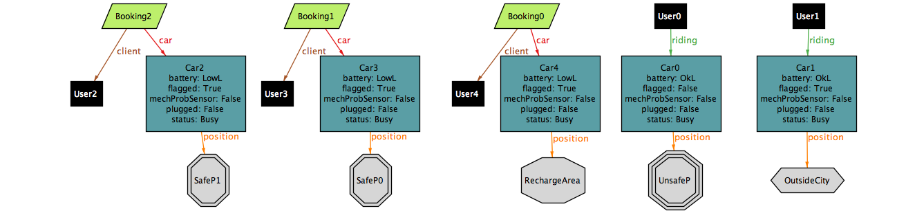
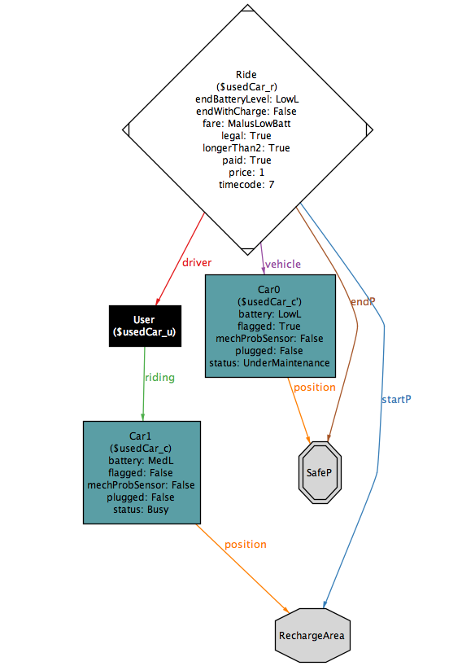

% **Requirements Analysis and Specification Document**
%Gianpaolo Branca
 Luca Butera
 Andrea Cini \newline
%\newpage

---
header-includes:
  - \usepackage[dvipsnames]{xcolor}
  - \usepackage{listings}
  - \usepackage{alloy}
---

\newpage

## 1 Introduction

### 1.1 Description of the given problem

We need to develop a system to support an electric car-sharing service, which have to be accessible for the users via a mobile application and provide our customers with a robust software infrastructure to manage their service.

### 1.2 Current company situation

The company which wants to provide the car-sharing service is already in the public transport business, therefore they have already a network of maintenance operators in the city area.
They also have an information system which provides channels for costumer-care, so that we will not need to provide it in the context of our system.
The company also has an efficient internal communication system to coordinate their staff, it will be used in our system to be through the provided APIs.

## 2 Goals

The system must:

- [G0] Make the user able to access to the system.
- [G1] Allow the clients to find an available car within a selected radius around his or a specified location.
- [G2] Allow the clients to book a car and pick it up.
- [G3] Monitor the usage of the car and charge the client with the right fare.
- [G4] Incentivize a correct usage of the service to allow as many as possible users to use the same car without the need of the service of an operator.
- [G5] Ensure a correct distribution of cars in the recharging stations according to the available plugs.
- [G6] Allow operators to manage and monitor the state of all the cars and notify them when maintenance is needed on a specific vehicle.
- [G7] Allow management system to set up and modify parameters of the system.
- [G8] Provide a real time, interactive, pleasant and transparent user experience.

## 3 Boundaries of the system

- The system to fulfill the goals that we have identified will use the Google Maps service to locate cars,users,operators and recharging stations and to provide the clients with navigation information.
- The system will rely on PayPal as a payment system as it is very reliable and a lot of users will appreciate its use.
- The system will provide operators of the company with the information needed for the maintenance of the vehicle but won’t involved in the coordination of the maintenance team.
- The system will not be able to check if the user behaves against the low, for example the system must ensure that a car is parked in a safe area but won’t be able to check if the car is correctly parked according to the law, anyway  all the data concerning car usage are collected and therefore it is possible to get to the physical person who committed the illicit.

## 4 Domain properties and assumptions

- [D1] The GPS service is always available and provides always the right position.
- [D2] The system cannot prevent theft.
- [D3] Operators are properly trained by the company to use the system and correctly mark cars under maintenance as unavailable.
- [D4] The plugs availability is correctly communicated to the system by the recharging station.
- [D5] User’s mobile phones are equipped with a GPS system and a camera and they are always working properly.
- [D6] The measure of the percentage of battery charge left and the estimation of the Km/% of charge ratio are correct.
- [D7] The internet connection of the cars is always working.
- [D8] The user has accepted the terms of use of the application.
- [D9] Every car is equipped with a display.

## 5 Glossary

1. Valid credential: Name, surname, birth date, driving license, PayPal account, valid e-mail address.
2. Current car details: Remaining battery, License plate number, an estimation of the remaining autonomy expressed in kilometers (calculated at average speed of 50 km/h in city traffic), the name and an picture of the car model.
3. Money saving option: An option that, if it has been activated, will provide the user with the information to find a suitable recharging station according to his the destination, the availability of plugs and uniform distribution of cars among the stations.
4. Safe area: area flagged by the management system as suitable for leaving the car and ending the ride.
5. Operator: in this document we refer as operator to the employees in charge of monitoring the state of the car from dedicated terminals of the company.
6. On screen notification: is a notification which is displayed on the screen located inside the vehicle.
7. Plugged: a car is considered plugged when a sensor detects that the specific car has been connected to the recharging system.
8. Update notification: is a notification sent by e-mail to the users which contains every detail of the update and eventually the new terms and conditions document.
9. Fee: a user can be charged with a fee for an improper use of the system, the value of the fee can be customized by the management system.
10. Busy: a car is marked as busy when ridden by a user or left parked but kept booked.
11. Ban: a banned user can not book car until his debt has not been satisfied.
12. Push notification: a notification that pops up in real time on the user's mobile phone or in the operator terminal.

## 6 Text assumptions

1. Discounts and penalties will be applied only in the case of a ride not shorter than 2km, so that the system will not punish users for not using poorly charged cars for short rides and will not encourage users to use fully charged cars less to get the discount.
2. Discounts and penalties percentage values can be customized by the management system.

## 7 Actors identifying

We have two main actors:

Client: is a person who has dowloaded our application and is registered to the service.

Operator: is an employee who has access to an interface that allows him to monitor the state of cars and eventually send assistance.

There are also secondary actors (such as third party service providers).

## 8 Requirements

### 8.1 Functional Requirements

In the following section we are going to identify the requirements that our system will have to fulfill to reach the goals.

- [G0] Make the user able to access to the system.

    - [R0.1] A user must sign up with valid credential.
    - [R0.2] The system must generate a password for the user and send it to him through e-mail.
    - [R0.3] A user must be able to visualize and modify all his personal informations.

- [G1] Allow the clients to find an available car within a selected radius around his or a specified location.

    - [R1.1] The system must be able to retrieve the location of the user.
    - [R1.2] The user must be able to scroll the map of the city to find a car or specify the radius (in km) around a selected location for the car research.
    - [R1.3] Upon the selection of a car the system must show an informative screen with current car details.

- [G2] Allow the clients to book a car and pick it up.

    - [R2.1] A client must be able to choose one of the available cars and book it.
    - [R2.2] Once a car has been booked no others reservation can be performed by the same client until the first one is pending.
    - [R2.3] After the reservation has been confirmed to the client, he has a maximum of 1 hour to reach the car, unlock it and start the engine. If the timeout expires the reservation is cancelled and a fee is applied.
    - [R2.4] The user is able to unlock a booked car trough the app at any time after the reservation, however he has a maximum of 15 minutes to turn it on after the unlocking. If this timeout expires, the reservation is cancelled the fee is applied.
    - [R2.5] The user in order and start the car has to check-in scanning a QR code in the car display and then press the physical start button.

- [G3] Monitor the usage of the car and charge the client with the right fare.

    - [R3.1] As soon as the engine starts the system must start charging the user with a fixed amount for minute and show the current price of the ride in the display of the car.
    - [R3.2] When a car is parked in a safe area and the engine is turned off, the system will ask the user through the car display if he wants to keep the car busy for at maximum 2h, if the user selects 'NO' or does nothing and leaves the car, the ride is considered as ended. If the user selects 'YES' the car is marked as busy.
    - [R3.3] An user can leave the car he's using and keep it busy with a time limit of 2 hours. During this time, since the battery is not being used, the management may configure a different fare. When the timeout expires if the car hasn't been picked up yet the client will be charged with the price of the ride up to that point.
    - [R3.4] A car parked in a place not marked as safe will be considered as busy, but if the client breaks the 2 hours timeout he will get a fine for improper use of the service (plus the regular price for the ride). The situation will be notified to the operators that will be able to choose if the car needs to be moved or not.
    - [R3.5] If the user drives outside the boundaries of the area of the service, the system must detect it, notify it to the user a and apply an additional time fare as a penalty. After 30 minutes an operator will be notified of the situation.
    - [R3.6] If the signal of a car is lost for more than 10 minutes, an operator will be notified with the last known position.
    - [R3.7] 5 minutes after the end of the ride the user is charged with the right amount and a push notification will be delivered on the user's mobile phone. The five minutes delay is necessary to give the client the possibility to eventually plug the car and get the corresponding discount.
    - [R3.8] If a user is unable to pay for a ride he will be banned from the system until the pending payment will be satisfied.

- [G4] Incentivize a correct usage of the service to allow as many as possible users to use the same car without the need of the service of an operator.(Note that discounts and penalties will not be applied to short rides, further details in Text Assumption n.1)

    - [R4.1] The system will show in the car display a QR code that must be scanned by the user, using the application, to check in. If 2 or more users check in, in addition to the driver, a discount will be applied to the ride.
    - [R4.2]  The system will apply a discount in the case that a car is left with more the 50% of the battery capacity available.
    - [R4.3] The system will detect when a car is left plugged in a recharging station at the end of a ride (using the GPS sensor and the informations sent to the system by the station) and will apply a discount . If the car is left in the recharging station but not plugged within 5 minutes the discount will not be applied.
    - [R4.4] The system will detect when a car is about to be left more than 3km away from the nearest recharging station and with 20% or less battery available, will warn the client and if the client proceeds to leave the car will apply a penalty to the price of the ride.
    - [R4.5] The client will be able to select a money saving option so that the system will provide him, trough the GPS navigator of the car, informations to reach the available recharging station which is more suitable according to the client destination and the need of the system to distribute car uniformly among the recharging stations.
    - [R4.6] The user will get only the higher discount between the ones of which at [R4.2] and [R4.3], eventually cumulated with the one stated at [R4.1], however the system will keep track of all the discounts applicable of a certain ride, then a procedure will calculate the final price according to this policy.

- [G5] Ensure a correct distribution of cars in the recharging stations according to the available plugs.

    - [R5.1] The system will help operators and the users with the money saving option on to choose the station in which cars should be recharged and left so that cars are reasonably distributed among the different stations in the city.
    - [R5.2] The amount of plugs available in a certain station must be monitored and the presence of non working ones detected.

- [G6] Allow operators to manage and monitor the state of all the cars and notify them when maintenance is needed on a specific vehicle.

    - [R6.1] The system will provide operators of the company with an interface to check the state of the cars.
    - [R6.2] Push notifications will notify when a car is need for assistance.
    - [R6.3] Cars with low battery level which are not likely to be used anymore will be flagged.
    - [R6.4] The system must interact with the old system to effectively ensure maintenance to the cars.

- [G7] Allow management system to set up and modify parameters of the system.

    - [R7.1] The system will provide an interface to select areas to mark as safe for parking. The selection of the locations will be possible specifying the boundaries of the areas using a map or a radius around an address.
    - [R7.2] The system will provide an interface to select the price for minute of the rides and during the busy state.
    - [R7.3] The system will provide and interface to customize fees and the percentage of discount and penalty for the cases highlighted in the [G.4] scope.

- [G8] Provide a real time, interactive, pleasant and transparent user experience.

    - [R8.1] After the end of each ride the system must notify the user with all the informations concerning the last usage, among which the total amount of money charged and details about eventual discounts or penalties.
    - [R8.2] If at the beginning of a ride the client is suitable for the discount of which at [R4.1], the system will notify it with an on screen notification.
    - [R8.3] At the end of a ride, if the user results parked inside a charging station, the system reminds him to insert the plug in the specific socket to get the discount of which at [R4.4] using an on screen notification.
    - [R8.4] The system eventually notifies the user with every update regarding the service, including changes in the terms and conditions document which will always have to be accepted again.

### 8.2 Non-functional Requirements

 - The mobile application must work on all the android devices with version 4.3 or higher and iOS 7 or higher.
 - The system must optimize bandwidth usage to guarantee a responsive service and to detect the position of a car real time.
 - For communication, secure protocols must be used.
 \newpage

#### 8.2.1 Mockup

##### Mobile App
{#id .class width=150}
{#id .class width=150}
{#id .class width=150}
{#id .class width=150}
{#id .class width=150}
{#id .class width=150}
\newpage

#####Car system \newline \newline

\centerline{\includegraphics[width=3.12500in]{./CarSystem/CarSystem-1.png}}

\centerline{\includegraphics[width=3.12500in]{./CarSystem/CarSystem-2.png}}
\newpage

#####Monitoring service \newline \newline

\centerline{\includegraphics[width=4.16667in]{./Monitoringservice/Monitoringservice-1.png}}

\centerline{\includegraphics[width=4.16667in]{./Monitoringservice/Monitoringservice-2.png}}
\newpage

## 9 Scenario identifying

Here are listed some different scenarios of our system to be usage.

### Scenario 1

Ted is running late for a job interview since the bus engine failed, so he opens the PowerEnJoy mobile application and searches for an available car around his current position within a radius of 700 meters. He finds that the nearest car is just 250 meters away, so he clicks the icon on the map corresponding to the chosen car and looks through the details screen; the car has 30% battery left but his destination is not far and from the estimation provided in the details he thinks the can make it, so he hits the "reserve" button, he drops off the bus and starts walking towards the car guided by the GPS. Arrived to the car, Ted clicks the "Open Car" button and enters the vehicle. Once inside the system asks Ted to scan the QR code on the car screen with the QR scanner featured in the PowerEnJoy application. Once recognized, Ted is free to power up the car and start his ride. When Ted arrives to his destination he powers down the car and gets an on screen notification saying that he has driven more than 2 kilometers, the car has less than the 20% of battery left and there isn't any recharging station within 3 kilometers from his position, therefore he can take the car closer to the recharging station and get a discount or leave there the vehicle but this will cost him an increased fare. Ted has no time to move the car so he decides to pay the penalty, he exits the car and the system takes care of locking it. The ride is successfully completed and Ted is charged for the right amount of money on his PayPal account.

### Scenario 2

Gwen has invited some friends over for dinner, while eating they decide to go out for a beer later, so Gwen decides to book a car with the PowerEnJoy application, John and Paula, her two friends, are not registered to the service yet; since Gwen wants to save money by taking two registered users with her, she asks them to download the application on their smartphone and proceed with the registration. Once opened the application they're asked if they want to login or to register, they choose the second and then insert valid credentials and receive their password via e-mail. Finished the dinner they go out, unfortunately Gwen forgets her driving license at home so they have to go back to get it and by the time they're back the reservation time expires and Gwen is charged with a fine for not having picked up the car in time. They proceed to book the same car again, since no other has done it in the meantime, get to it and step inside. Now the three scan the QR code with their smartphones and the system notifies Gwen that a discount will be applied on the cost of the trip. Once at destination they drop off the car and the system sends a notification warning that she left the car in a non safe area and therefore she has to keep paying with a reduced fare and must get back to the car in at most two hours. They are ok with that and walk inside the pub, again they loose track of time until Gwen's phone rings as she gets notified that two hours passed and she's getting to pay for them plus another fine for improper use of the service.

### Scenario 3

Tony is preparing to go to his friend Matt, he's going to ride there with Matt's bike which he borrowed a week ago so he can give it back to him, after that they have to go to the shopping center at the boundaries of the city, so Tony decides to book a PowerEnJoy car with the mobile application. He inserts Matt's house address into the system and books the most convenient car. Once at Matt's place the two go to pick the car up, once they are inside and the check-in is done, they decide to select the "money saving option", after inserting their destination the system provides them a suitable recharging station to leave the car at. Luckily for them the recharging station is inside the shopping center area so, once parked, they power the car down and get out, once outside they insert the plug in the specific socket and leave. The system notifies Tony with the payment details including the applied discount.

### Scenario 4

Melanie, a PowerEnJoy operator, is working at her terminal, monitoring the cars in her assigned area through the interface provided by the PowerEnJoy system.
She is checking through flagged cars which have low battery level. The first she overviews has been recently used and is in a central part of the city so she decides to leave it as it is, since it's likely it will be used anyway. The second one is in a remote part of the city and hasn't been picked up or booked since the previous day, so she decides to send maintenance personal to recharge it. To do so she enters the "assistance request" screen and starts to type in the request details. While doing so she gets a push notification that warns her about the urgent need of maintenance for a vehicle. Thanks to the maintenance system integration she's able to quickly forward the request to the specific facility which will take charge of it and therefore she can go back to the request she was previously working on. After successfully sending on the request she goes back to the analysis of the flagged cars, until she gets another notification, this time the notification reports that a user has improperly left a car for more than two hours outside a safe parking area, she looks over the details and finds out that the car is in the suburb of the town and so she decides to ask for an operator to have it picked up and moved inside of a safe area, again through the integrated system she's able to have a maintenance operator to handle the request.

### Scenario 5

Bob, an operator of PowerEnJoy, has been assigned to update the system terms regarding to a new company policy. First of all he modifies the cost per minute for the service usage from 26 cents/minute to 28 cents/minute. The price raise is balanced with a proper increase in discounts, so, still through the provided interface, Bob can increase the discount, for leaving the car plugged in a charging station, from 25% to 30% on the full price of the ride. In the end Bob has to insert two new safe areas and to remove one; the interface allows Bob to select the proper utility and he can easily select, from the list of safe areas, the one to delete. Now he inserts the first new area just by specifying the chosen address and the radius around it, which in this case is of 2.6 km. Since the second area has a more complicated shape he selects the drawing tool and easily draws the polygon defining the selected area, then the system commutates the area drew on the map into proper coordinates to identify it. After this process Bob checks out the update, the system generates a proper notification containing the new terms and conditions document and the update details and therefore sends it over to the users.

\newpage

## 10 UML Models

### 10.1 Class Diagram

\centerline{\includegraphics[width=6.25000in]{./classdiagram/classdiagram-1.png}}
\newpage

### 10.2 Use case diagram

\centerline{\includegraphics[width=6.25000in]{./uc/uc.png}}
\newpage

### 10.3 Use case description

In this section are listed some common or significant use cases derivable from the Use Case diagram.

#### User logs in

+-----------------------+-----------------------------------------------------+
| **Name**              | User logs in                                        |
+-----------------------+-----------------------------------------------------+
| **Goals**             | G0                                                  |
+-----------------------+-----------------------------------------------------+
| **Actors**            | Non authenticated user                              |
+-----------------------+-----------------------------------------------------+
| **Entry conditions**  | The user must be registered but hasn't logged on    |
|                       | yet.                                                |
+-----------------------+-----------------------------------------------------+
| **Flow of events**    | - The user enters the login screen of the mobile    |
|                       |   application.                                      |
|                       | - The user types in his username and his password.  |
|                       | - The user taps on the "Login" button.              |
|                       | - The user is redirected to the car research screen.|
+-----------------------+-----------------------------------------------------+
| **Exit conditions**   | The user is redirected on the car research screen.  |
+-----------------------+-----------------------------------------------------+
| **Exceptions**        | The username and the password are not a valid       |
|                       | couple. If this happens the system doesn't allow the|
|                       | user to enter the research screen, however he's     |
|                       | notified of the incorrectness of the credentials and|
|                       | therefore is kept on the login screen to try again. |
+-----------------------+-----------------------------------------------------+

\newpage

#####Login Sequence Diagram\newline

\centerline{\includegraphics[width=6.25000in]{./FlowDiagrams/UserLoginSD.png}}

\newpage

####  User registers

+-----------------------+-----------------------------------------------------+
| **Name**              | User registers                                      |
+-----------------------+-----------------------------------------------------+
| **Goals**             | G0                                                  |
+-----------------------+-----------------------------------------------------+
| **Actors**            | Non authenticated user                              |
+-----------------------+-----------------------------------------------------+
| **Entry conditions**  | The user is not registered to the service yet.      |
+-----------------------+-----------------------------------------------------+
| **Flow of events**    | - The user enters the login screen of the mobile    |
|                       |   application.                                      |
|                       | - The user taps on the "Register" button.           |
|                       | - The user is redirected to the credential insertion|
|                       |   screen.                                           |
|                       | - The user inserts his name, surname, birth date and|
|                       |   driving license ID in any order.                  |
|                       | - The user taps on the "Next" button.               |
|                       | - The user is redirected to the PayPal account insertion screen. |
|                       | - The user inputs his PayPal credentials.           |
|                       | - The user taps on the "Next" button.               |
|                       | - The user is redirected to the e-mail insertion screen. |
|                       | - The user types in an e-mail address.              |
|                       | - The user taps on the "Confirm" button.            |
|                       | - The system sends a confirmation message to the specified e-mail address. |
|                       | - The user is redirected to a screen informing him to check is e-mail. |
|                       | - The user clicks on the link contained in the sent e-mail. |
|                       | - The system activates the new user's account.      |
|                       | - The user is redirected into the mobile application inside a successful registration screen. |
|                       | - The user taps on the "Confirm" button.            |
|                       | - The user is redirected to the car research screen.|
+-----------------------+-----------------------------------------------------+
| **Exit conditions**   | The user is registered and is redirected to the car research screen. |
+-----------------------+-----------------------------------------------------+
|**Exceptions**         | The user inserts invalid PayPal credentials or license ID, personal information do not match license credentials, license or e-mail address are already bounded to an existing profile. In this case the user is notified of the error and is redirected to the login screen.          |
+-----------------------+-----------------------------------------------------+

\newpage

#### User searches and reserves a car

+-----------------------+-----------------------------------------------------+
| **Name**              | User searches and reserves a car |
+-----------------------+-----------------------------------------------------+
| **Goals**             | G1, G2 |
+-----------------------+-----------------------------------------------------+
| **Actors**            | User |
+-----------------------+-----------------------------------------------------+
| **Entry conditions**  | The user is logged in the mobile application. |
+-----------------------+-----------------------------------------------------+
| **Flow of events**    | - The user enters the car research screen. |
|                       | - The user types in an address or chooses to use his GPS location. |
|                       | - The user hits the "Search" button. |
|                       | - The system shows in the map all the available cars in the selected location |
|                       | - The user clicks on the chosen car. |
|                       | - The system shows a pop-up with the car informations.|
|                       | - The user hits the "Book now" button. |
|                       | - The user is redirected to the booking details page, showing the time left before the reservation expires. |
+-----------------------+-----------------------------------------------------+
| **Exit conditions**   | The car is correctly reserved and the user is redirected to the map screen. |
+-----------------------+-----------------------------------------------------+
| **Exceptions**        | The chosen car is no more available. In this case the user is notified of the error and redirected to the map screen. |
+-----------------------+-----------------------------------------------------+

\newpage

#####Booking Sequence Diagram

\centerline{\includegraphics[width=5.20833in]{./FlowDiagrams/CarBookingSD.png}}
\newpage

#### User picks the car up

+-----------------------+-----------------------------------------------------+
| **Name**              | User picks the car up |
+-----------------------+-----------------------------------------------------+
| **Goals**             | G2 |
+-----------------------+-----------------------------------------------------+
| **Actors**            | User |
+-----------------------+-----------------------------------------------------+
| **Entry conditions**  | The user made a reservation for the car he's about to pick up. |
+-----------------------+-----------------------------------------------------+
| **Flow of events**    | - The user enters his profile screen. |
|                       | - The user hits the car reservation inside the history tab. |
|                       | - The user is redirected to the reservation details screen. |
|                       | - The user touches the "Unlock" button. |
|                       | - The system unlocks the car. |
|                       | - The user enters the car. |
|                       | - The Car screen power on. |
|                       | - The user clicks on the QR scanner button. |
|                       | - The user scans the QR code on the car screen. |
|                       | - The user powers the engine by pressing the physical button inside the car. |
+-------------------------------+---------------------------------------------+
| **Exit conditions**   | The user checked in and the car is powered up. |
+-----------------------+-----------------------------------------------------+
| **Exceptions**        | - The user unlocks the car but doesn't power it up in 15 minutes. If this happens then the car is marked as free and locked up again. |
+-----------------------+-----------------------------------------------------+

\newpage

#### User starts a ride with money saving option

+-----------------------+-----------------------------------------------------+
| **Name**              | User starts a ride with money saving option |
+-----------------------+-----------------------------------------------------+
| **Goals**             | G4, G5 |
+-----------------------+-----------------------------------------------------+
| **Actors**            | User |
+-----------------------+-----------------------------------------------------+
| **Entry conditions**  | User checked in and powered up the car. |
+-----------------------+-----------------------------------------------------+
| **Flow of events**    | - The user clicks the "Money saving" button on the car screen. |
|                       | - The car shows the destination insertion screen. |
|                       | - The user inserts his destination and hits the "Confirm" button. |
|                       | - The system calculates the optimal charge station. |
|                       | - The car monitor show the GPS navigation map screen with the selected charge station as destination. |
|                       | - The user starts his ride. |
+-----------------------+-----------------------------------------------------+
| **Exit conditions**   | The user is riding the car and the car screen shows the navigation towards the desired destination. |
+-----------------------+-----------------------------------------------------+
| **Exceptions**        | In the case there's no compatible charging station the user is redirected to a screen notifying the problem and then back to the initial car screen. |
+-----------------------+-----------------------------------------------------+

\newpage

#### The user parks and keeps the car as busy

+-----------------------+-----------------------------------------------------+
| **Name**              | The user parks and keeps the car as busy |
+-----------------------+-----------------------------------------------------+
| **Goals**             | G2 |
+-----------------------+-----------------------------------------------------+
| **Actors**            | User |
+-----------------------+-----------------------------------------------------+
| **Entry conditions**  | The user picked the car up and is riding it. |
+-----------------------+-----------------------------------------------------+
| **Flow of events**    | - The user parks the car and powers down the engine.|
|                       | - The user is redirected to the ride ending screen. |
|                       | - The user selects the "Keep as busy" button.       |
|                       | - The user exits the car and closes the car door.   |
|                       | - The system locks the car.                         |
|                       | - The user enters his profile screen.               |
|                       | - The user hits the busy car reservation inside the history tab. |
|                       | - The user is redirected to the reservation details screen. |
|                       | - The user hits the "Unlock" button.                |
+-----------------------+-----------------------------------------------------+
| **Exit conditions**   | The user picked up the car again. |
+-----------------------+-----------------------------------------------------+
| **Exceptions**        | The user doesn't unlock the car before two hours passed from the moment he made the car busy. In this case the car is marked as free and the user is charged for the extra time the car was kept eccupied plus a fine if the car was left outside a safe area. |
+-----------------------+-----------------------------------------------------+

\newpage

#### User ends a ride

+-----------------------+-----------------------------------------------------+
| **Name**              | User ends a ride |
+-----------------------+-----------------------------------------------------+
| **Goals**             | G3 |
+-----------------------+-----------------------------------------------------+
| **Actors**            | User |
+-----------------------+-----------------------------------------------------+
| **Entry conditions**  | The user parked the car which is still powered on. |
+-----------------------+-----------------------------------------------------+
| **Flow of events**    | - The user powers down the engine. |
|                       | - The car monitor show the ride ending screen. |
|                       | - The user selects the "End ride" button. |
|                       | - The user exits the car and closes the car door. |
|                       | - The system calculates the fare for the ride. |
|                       | - The user is charged for the service usage. |
+-----------------------+-----------------------------------------------------+
| **Exit conditions**   | The car is free and the user is charged with the amount due. |
+-----------------------+-----------------------------------------------------+
| **Exceptions**        | - At the end of the ride the user has not enough money to pay on his PayPal account. If that's the case then the payment will be kept as pending and during this time the user will be banned and will be unable to use the service. |
+-----------------------+-----------------------------------------------------+

\newpage

#####Ride Activity Diagram \newline

\centerline{\includegraphics[width=6.25000in]{./FlowDiagrams/RideFlowAD.png}}

\newpage

#####Car State Diagram \newline

\centerline{\includegraphics[width=6.25000in]{./FlowDiagrams/CarSD.png}}

\newpage

#####Discount/Penalty Activity Diagram \newline

\centerline{\includegraphics[width=6.25000in]{./FlowDiagrams/DiscountPenaltyAD.png}}

\newpage

#### Operator enrolls an assistance request

+-----------------------+-----------------------------------------------------+
| **Name**              | Operator enrolls an assistance request |
+-----------------------+-----------------------------------------------------+
| **Goals**             | G6 |
+-----------------------+-----------------------------------------------------+
| **Actors**            | Operator |
+-----------------------+-----------------------------------------------------+
| **Entry conditions**  | The operator is logged into the system. |
+-----------------------+-----------------------------------------------------+
| **Flow of events**    | - The operator enters the map screen. |
|                       | - The operator clicks on a new issue form the list. |
|                       | - The operator is redirected to a deep issue details screen. |
|                       | - The operator types in the form the details of the request. |
|                       | - The operator selects the facility of which the request must be sent to. |
|                       | - The operator hits the "Send request" button. |
|                       | - The system attaches the details of the car to the request and sends it. |
|                       | - The operator is redirected to the map screen. |
+-----------------------+-----------------------------------------------------+
| **Exit conditions**   | The request is correctly enrolled to the specified facility. The operator is back on the map screen. |
+-----------------------+-----------------------------------------------------+
| **Exceptions**        | The request can't be enrolled or the operator forgot to fill in one of the fields. In this case the system shows an error screen notifying the problem and asking the operator to try again, then redirects him back to the request screen. |
+-----------------------+-----------------------------------------------------+

\newpage

#####Assistance Request Sequence Diagram
\centerline{\includegraphics[width=6.25000in]{./FlowDiagrams/AssistanceRequestSD.png}}
\newpage

#### Operator inserts a new safe area

+-----------------------+-----------------------------------------------------+
| **Name**              | Operator inserts a new safe area |
+-----------------------+-----------------------------------------------------+
| **Goals**             | G7 |
+-----------------------+-----------------------------------------------------+
| **Actors**            | Operator |
+-----------------------+-----------------------------------------------------+
| **Entry conditions**  | The operator is logged into the system. |
+-----------------------+-----------------------------------------------------+
| **Flow of events**    | - The operator enters the safe areas management screen. |
|                       | - The operator clicks on the "New safe area" button.|
|                       | - The operator is redirected to a map screen showing the set of safe areas. |
|                       | - The operator clicks on the polygonal drawing tool.|
|                       | - The operator is redirected on the vertices insertion screen. |
|                       | - The operator inserts the coordinates of the vertices clicking on the map. |
|                       | - The operator clicks the "Confirm" button. |
|                       | - The operator is redirected to the map screen now showing the new safe area. |
|                       | - The operator clicks on the "Save and exit" button. |
|                       | - The system generates the update details notification. |
|                       | - The system sends the update details notification to the users. |
|                       | - The operator is redirected to the initial terminal screen. |
+-----------------------+-----------------------------------------------------+
| **Exit conditions**   | The new safe area is correctly inserted in the system and the update details notification is successfully sent to the users. The operator is redirected to the initial screen. |
+-----------------------+-----------------------------------------------------+
| **Exceptions**        | - The operator has not defined a proper area (e.g. not a valid shape). In this case the operator is redirected to the previous screen and notified of the mistake and must perform the action again correctly. |
+-----------------------+-----------------------------------------------------+

\newpage

## 11 Alloy Model

\lstinputlisting[language=alloy]{alloymodel.als}

**Result:** \newline
\centerline{\includegraphics[width=1.00000\textwidth,height=1.00000\textwidth]{./alloyworlds/result.png}}
\newpage

### 11.1 Generated Worlds

#### Generic world

Result of the show predicate: \newline
{#id .class width=100% height=100%}

#### Ride properties

Result of the showRides predicate: \newline
{#id .class width=100% height=100%}

\newpage

#### Booking and riding properties

Result of the showRidingAndBookings predicate:\newline \newline
{#id .class width=100% height=100%}

#### Assistance properties

Result of the showAssistance predicate:\newline
{#id .class width=100% height=100%}

\newpage
#### Dynamic Models

Result of the usedCar predicate:\newline
{#id .class width=100% height=100%}

Result of the assistanceGiven predicate:\newline
{#id .class width=100% height=100%}

\newpage

Result of the bookedCar predicate:\newline \newline
{#id .class width=100% height=100%}

\newpage

## 12 Used tools

- Atom (with MarkDown Preview Plus package) for writing Pandoc MarkDown with syntax highlighting and the preview feature.
- Pandoc to craft the LaTeX document from the MD one and the pdf from the LaTeX.
- TexShop to edit the LaTeX document(credits to [_Angtrim_](https://github.com/Angtrim/alloy-latex-highlighting) on GitHub for the Alloy syntax highlighting).
- Alloy analyzer 4.2.
- Signavio for the use case, class and activity diagrams.
- Draw.io for the sequence diagrams.
- Balsamiq for the GUI mockups.

##13 Reference material

- Project assignment from : Assignments AA 2016-2017.pdf.
- RASD example : RASD sample from Oct. 20 lecture.pdf.
- IEEE standard on requirement engineering.

##14 Future Development

- Enhance the efficiency of the communications with the road operators.
- Extend the customizability of the system (e.g. the possibility to add more discounts/penalties).

##15 Hours of work

Each group member spent around 30 hours drafting the document. (The commits on GitHub are not completely representative of the work done, a good part of it has been done in group.)
