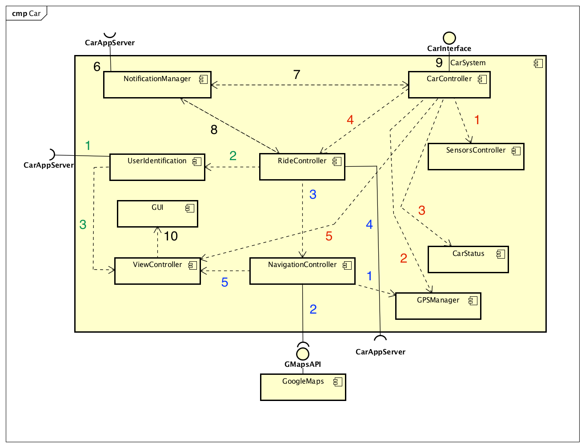

% **Integration test document - v1.0**
%Gianpaolo Branca
 Luca Butera
 Andrea Cini
%\newpage

##Introduction

###Purpose

###Scope

###Definitions
* Bottom-up: a strategy that starts from the lower level to the higher level components.
* Stub: a fake component that simulate the behaviour of the one that is not already integrated. It is used to test other components that require interaction with this one.

###Abbreviations
* GUI: Graphical unit interfaces
###Reference documents
* Specification document
* RASD
* Design document
* Integration test document sample on Beep
##Integration strategy

###Entry criteria
* Every developed component must be unit tested
* All method exposed by server must be callable
* All GUIs must give the possibility to call all the desired methods in the interfaces, although the GUIs does not have to be refined in details
* Data structures must be defined (JEE entities) and methods that access to the database tested.
* The Database must be populated with test datas
* External services must be callable

###Elements to be integrated

###Integration test strategy
We decided to follow a bottom-up approach because is simpler

###Sequence of component integration

####Car

__N = Navigation tests (blue)__, tests concerning the navigation aspect of the system   
__S = Status tests (red)__, tests about the sensors and status of the Car  
__U = User tests (green)__, tests about the user identification  
__G = General tests (black)__, test that interact with multiple aspect of the system; those test have to be done after the other three categories of tests.

| ID     | Components     |
| :------------- | :------------- |
| N1 | NavigationController -> GPSManager
| N2 | NavigationController -> GoogleMaps
| N3 | RideController -> NavigationController
| N4 | RideController -> CarAppServer
| N5 | NavigationController -> ViewController
| S1 | CarController -> SensorsController
| S2 | CarController -> GPSManager
| S3 | CarController -> CarStatus
| S4 | CarController -> RideController
| S5 | CarController -> ViewController
| U1 | UserIdentification -> CarAppServer
| U2 | RideController -> UserIdentification
| U3 | UserIdentification -> ViewController
| G6 | NotificationManager -> CarAppServer
| G7 | NotificationManager -> CarController
| G8 | NotificationManager -> RideController
| G9 | CarController -> CarInterface
| G10 | ViewController -> GUI   
##Individual steps and test description

##Tools and test equipment required

##program stubs and test data required
Since we decided to follow a bottom-up appro
##Effort spent
