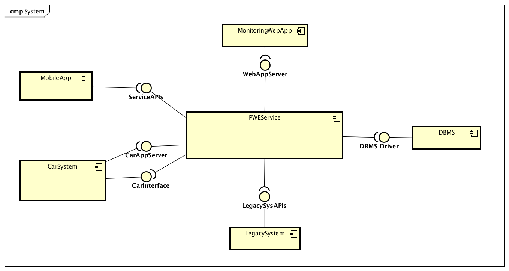
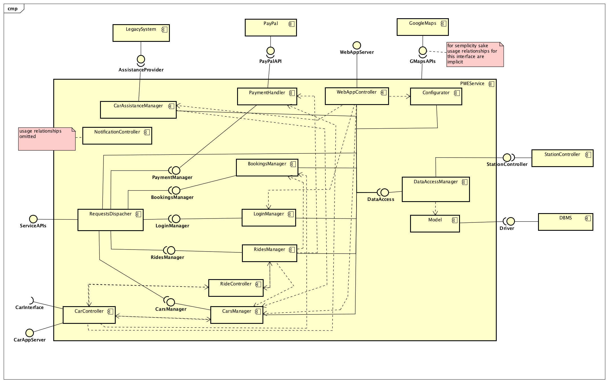
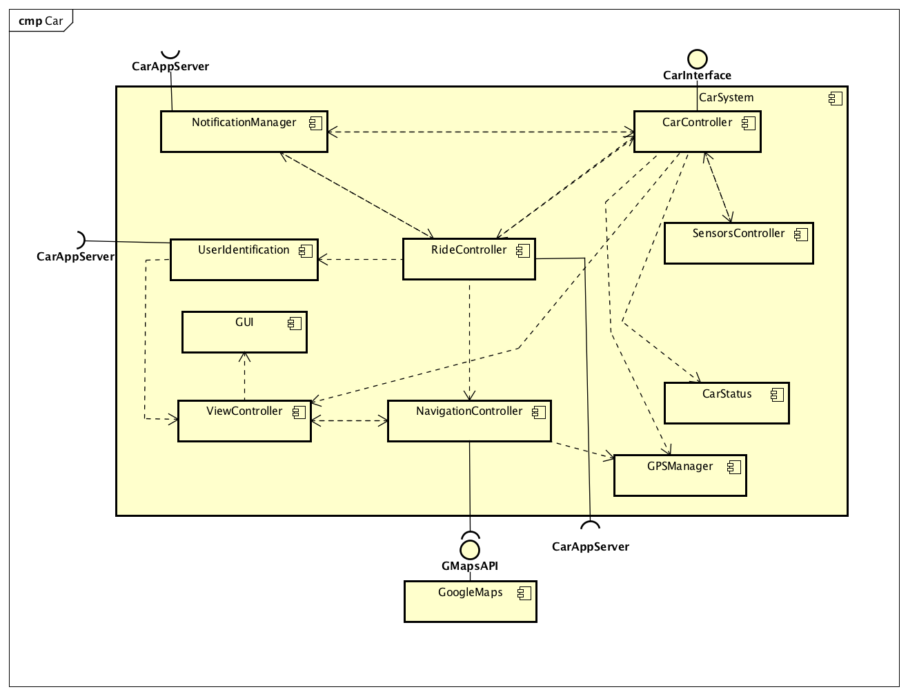
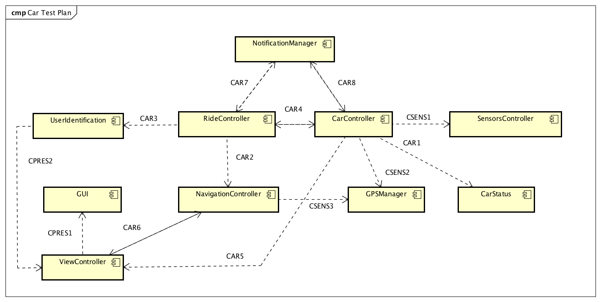
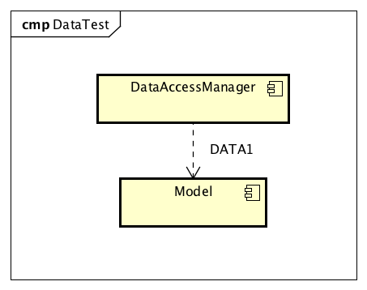
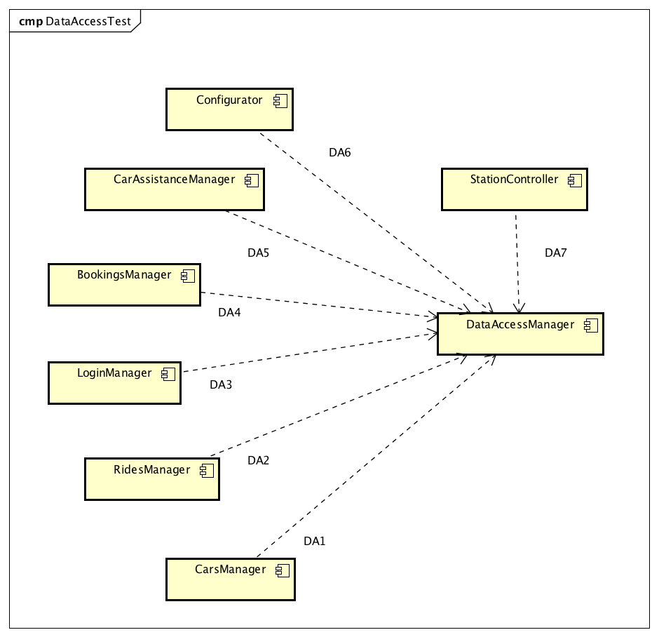
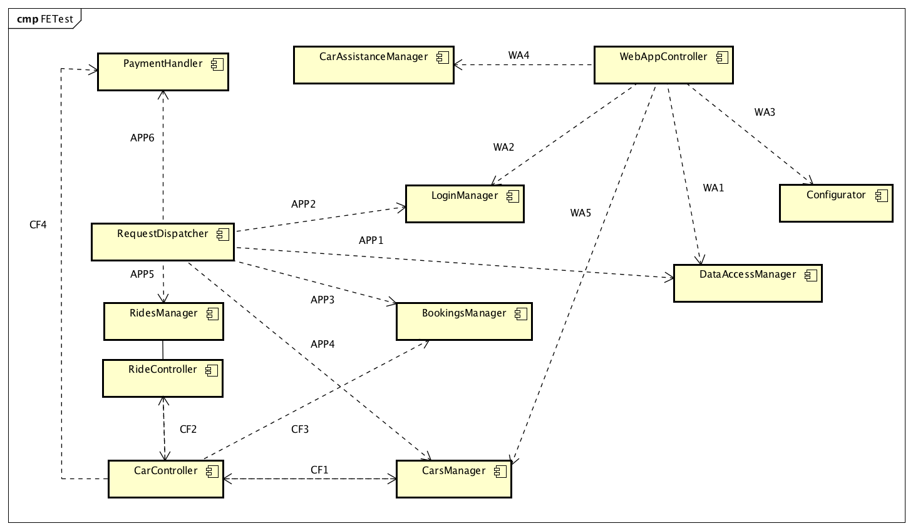
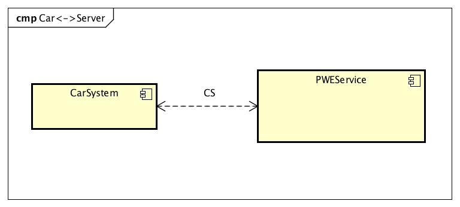
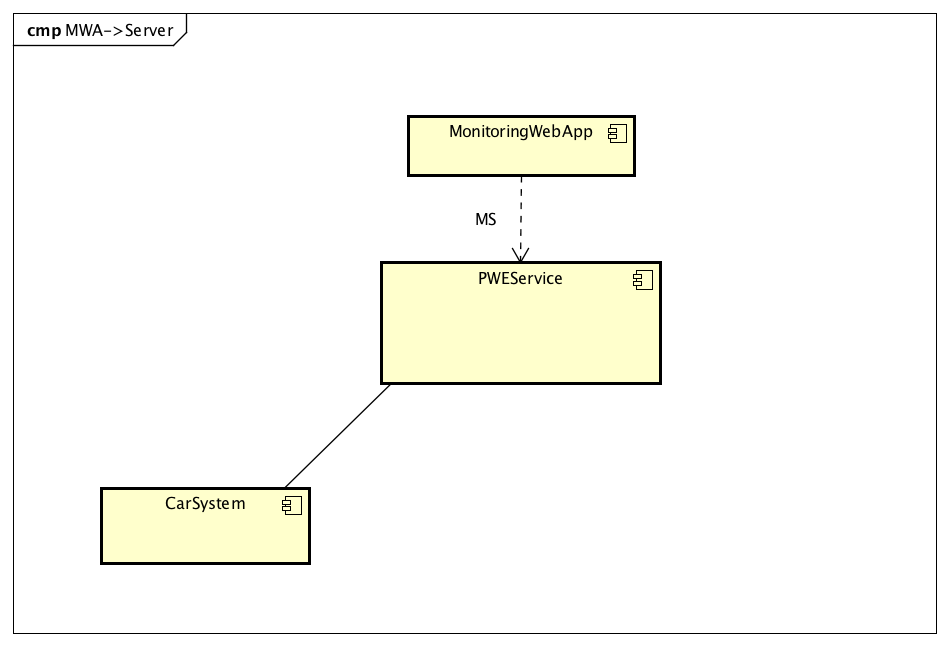
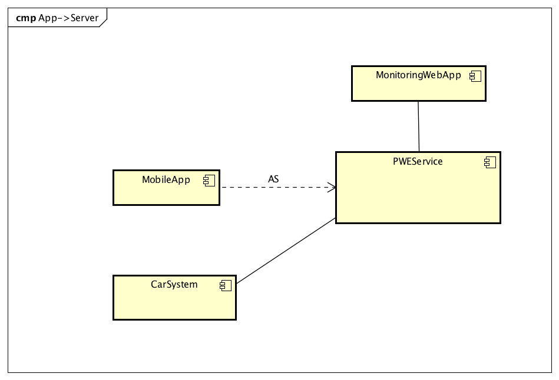

% **Integration test document - v1.0**
%Gianpaolo Branca
 Luca Butera
 Andrea Cini
%\newpage

\newpage
# 1 Introduction

## 1.1 Purpose

The aim of this document is to structure an integration testing strategy for the system we are going to develop. This activity is crucial for the success of the project due to its highly distributed and partitioned nature. Our intention is to define a clear plan of the procedure to follow referring to well-known practice for testing, keeping in mind the very structure of the system as presented in the Design Document.

## 1.2 Scope

The system, as designed in the DD, will consist in different components, deployed in different machines and part of the logic will be highly distributed over the single cars meaning that integration of components has to be tested in advance to prevent wrong behavior and bugs hard to fin once the system has been deployed. The main subsystems that we can identify in our system are: the **CarSystem**, the **PWEService**, the **MonitoringWebApp** and the **MobileApp**; in the next sections we are going to identify the steps needed for the final integration testing of these components as well as the tools and the techniques we are going to exploit.

## 1.3 Definitions

* **Integration test**: the phase in software testing in which the single components are combined together and tested in as a whole.
* **Unit test**: unit testing is a testing activity concerning only one element of the system (a component in our case), while integration testing is about the system as a whole.
* **Bottom-up**: a strategy that starts testing from the lower level to the higher level components.
* **Top-down**:  a strategy that starts testing from the higher level to the lower level components.
* **Stubs and drivers**: elements that simulate the behavior of components of the system not integrated yet. In particular stubs simulate functionalities and drivers simulate requests.
* **Arquillian**: a tool for the integration testing of JEE applications.
* **JUnit**: a framework for running unit tests of Java applications.
* **Mockito**: a mocking tool for Java tests.
* **Ripple**: a tool for testing PhoneGap powered applications. More information [_here_](http://emulate.phonegap.com/).

## 1.4 Abbreviations

* __GUI:__ Graphical unit interfaces
* __GPS:__ Global position system
* __JPA:__ Java Persistent API
* __N/A:__ Not applicable

## 1.5 Reference documents

* The specification document.
* The RASD.
* The DD.
* Integration test document samples on the Beep platform.

# 2 Integration strategy

{#id .class width=100% height=100%}\
{#id .class width=100% height=100%}\
{#id .class width=100% height=100%}\

## 2.1 Entry criteria

Before starting the integration test activity a solid version of both the RASD and the DD must have been provided so that the interactions between the components are reasonably clear and well defined.
In our belief, for the integration tests to be effective and meaningful, the followings points have to be reached:

  * The data access layer must have been fully developed (**DataAccessManager**, **Model**, **StationController**) and the DBMS integrated.
  * At least 70% of the **PWEService** and **CarSystem** components functionalities must be implemented.
  * The **MobileApp** and the **MonitoringWebApp** components development is not critical for integration purpose (they offer presentation functionalities), but it must have reached a point in which they provide a way to call every service provided by the central node through its interfaces.
  * Agreements with the external services providers must have been reached and the services must be available, recharging stations included.

We do not expect the integration of PayPal and GoogleMaps to be problematic (the reliability of the services offered by PayPal and Google is not in doubt), so we will not consider the integration of these external services in the scope of this document.
Every single component must be unit tested with at least an 80% branch coverage and its main functionalities fully developed before going into the integration test phase.

## 2.2 Elements to be integrated
Starting from the High level component view of our system, the subsystems to be considered for integration testing are:

  * The **PWEService** and the **CarSystem** are the most critical components to be tested.
  * The **MonitoringWebApp** and the **MobileApp**, as already mentioned, are not essential for the integration test progression as they can be easily substituted by simple drivers until the system integration test.
  * Assuming that the **LegacySystem** works correctly a stub seems rather good for our purposes.
  * The integration of the **DBMS** should be straightforward with the usage of the JPA framework.

## 2.3 Integration test strategy

For our integration test we will use a mixed approach because, while going always bottom-up or always top-down would give us the benefit of a simpler integration plan, a more dynamic approach based on the specific group of components under consideration will allow us to test in a more effective and meaningful way.
At the start we will focus on the integration of the subcomponents of the two main subsystem that we have identified that will be performed in parallel:

  * **CarSystem**: At first the tests will be carried out on a virtual machine to simulate the car environment with a stub and a driver for the **SensorsController** and **GPSManager**, later on, after the unit test of the sensor controller in a real vehicle, the whole Car Application will be deployed on a car and the integration with these components properly tested.

  * **PWEService**: To test the components of the central node we will use a strategy based on the bottom-up approach, starting from the back-end going towards the front-end:
    * Step 1: we will test the integration of the component of the data access layer.
    * Step 2: we will test the integration of the internal components(the ones which do not realize any interface accessible from external components) with the data access components.
    * Step 3: we will test the integration of the internal components within each other.
    * Step 4: we will test the integration of the most external components with the rest of the system.

## 2.4 Sequence of component integration

The following tests are meant to be in context of a procedure that replacing on stub/driver after another with the real components will lead to test of the integration of the whole system. However, in some cases, the single tests can be useful at the level of unit-testing and in this case most of them are easy to reproduce using stubs and drivers for the part of the components (these kind of testes will not substitute the execution of the test case during the integration test process).

### 2.4.1 Software integration sequence

In this section we are going to analyze the tests that are needed for the subcomponents of each subsystem.
To describe the sequence in which the components will be integrated, we will use diagrams of components linked with labeled and oriented arrows. The label will identify the flow of tests and the order within the flow.

#### Car System

{#id .class width=100% height=100%}\

The **CarSystem** sub-components integration will happen in two steps and for both of the two steps a stub and a driver for the **PWEService** will be needed:

  * Step 1, performed in a virtual machine environment: We will follow two parallel flows of tests:

      * CAR tests: using stubs for the **SensorsController** and **GPSManager** we will test the critical components of the subsystem in the order highlighted in the diagram(arrows with CAR labels). These components are the most domain specific ones and their integration has to be considered with particular care.
      * CPRES tests: tests for the integration on the components of the presentation layer, they can be carried out in parallel from the CAR testes until the involved components are required by CAR components. More details on the sequence are in the individual tests description.  

  * Step 2 :

      * After the tests of the step 1 has been performed the application will be deployed in a real vehicles and the integration of the **SensorsController** and **GPSManager** will be tested with the possibility to manipulate the car to simulate mechanical problems (CSENS tests).

#### PWEService

In the following section we are going to analyze the necessary steps that we going to perform to test. To do that we will use a diagram for each step. It's important to notice that the diagrams are complementary and that each step incrementally concurs to the integration testing of the entire subsystem. For simplicity sake in each step diagram the connections with the components tested in previous steps are omitted in the diagrams, but obviously we will not use stubs or drivers in the place of components which integration has already been tested (e.g. the in the second step we won't show the component **Model** even if it is involved in the testing activity). The correct integration of the **NotificationController** will be tested mainly during the integration of the subsystems because at this level it would not be so meaningful.

As already mentioned in the previous sections we will start the integration of the subcomponents of the central node starting from the data access ones.

**Step 1**:

{#id .class width=50% height=50%}\

The integration of the **DataAccessManager**(a component its job is to make queries and manipulate the data using the services of the JPA framework) with the **Model** EntityManagers has to be be performed with care to ensure that the set of data that are retrieved and the ones that are generated are correct and consistent.

---

After the first step has been performed we will move on to the next set of tests that will test if the core components of the system can access the data correctly through the interface provided by the **DataAccessManager** component.

**Step 2**:

{#id .class width=100% height=100%}\

If the integration test of the **DataAccessManager** with the EntityManagers as been performed correctly this part should be quite straightforward and should not be so many problems occurring. The order in which the tests will be performed is not essential and they can be done in parallel, the labels names suggest a possible order.

---

**Step 3:**

After the operation concerning the data access has been tested the next step will be testing the integration of the internal components.

{#id .class width=100% height=100%}\

In this step we are going to test the expected behavior of the core business logic functionalities. A large collection of test cases is needed to correctly verify the robustness of the system up to this point.

---

**Step 4**

Finally we are going to test the integration of the front-end components with the rest of the system starting from the integration of the **CarController** component, then the **WebAppController** component and last the component providing the API for the mobile app, the **RequestDispatcher**.

{#id .class width=100% height=100%}\

The tests regarding the integration of the **CarController**(CF labels) will be the first to be performed because it is the more independent from the other 2 front-ends, than the **WebAppController**(WA labels) who needs modules the **CarController** to be integrated first to be more meaningful, and last the **RequestDispatcher** which with its integration will be the final stress-test for the cohesion of all the other modules.

### 2.4.2 Subsystems integration sequence

After the car and the central subsystems have been tested properly at the level of their sub-components, we will proceed with the integration between the subsystems themselves.
Recapping, the 4 subsystems to be integrated are:

* The **PWEService**
* The **CarSystem**
* The **MobileApp**
* The **MonitoringWebApp**

We will proceed with the integration as it follows (bottom-up):

* **Starting point (Step 0)**: We will use the **PWEService** as the starting element of the integration and will go on substituting one stub/driver of the other components at a time with the real component.

* **Step 1**:
 The first component we are going to integrate is the **CarSystem**. This integration has to be performed first so that the next integration tests (that otherwise would have needed a stub and a driver for the **CarSystem**) will be more meaningful. This step is probably the most critical (functionally and performance wise) over the whole integration testing activity as the interaction between these two components are the most complex one.
 After the tests have been carried out in a virtual machine to emulate the car environment a test on a real vehicle will be needed.
 {#id .class width=100% height=100%}\

 * **Step 2**:
 This integration tests the correct interaction between the **MonitoringWebApp** and the **PWEService** through the provided interface. We do not expect particular difficulties in this test phase.
 This test could be iterated multiple times as the refinement of the web application pages goes on.\
 {#id .class width=100% height=100%}\

* **Step 3**:
 The final step will be the integration of the **MobileApp**, as for the web app, this test should be straightforward (if the other test has been carried out with care). Due to the flexibility of Cordova part on the test can be performed on a browser (using the Chrome extension Ripple, for example), then on simulators (iOS, android) and finally on physical devices.
 This test will prove the robustness of the RESTful api provided by the server.
 {#id .class width=100% height=100%}\

# 3 Individual steps and test description

## 3.1 Software integration sequence

Results for null parameters or invalid parameters, if the outcome isn't explicitly specified, always end up in a NullArgumentException for the former and InvalidArgumentException for the latter.

### CAR Tests

#### Test case CAR1

**Test items:** CarController -> CarStatus  
**Environmental needs:** N/A  

The CarStatus is a rather simple component since it only contains a representation of the current status of the car. Therefore the purpose of this test case is to assure that the CarController correctly updates the CarStatus and retrieves informations from it.

#### Test case CAR2

**Test items:** RideController -> NavigationController  
**Environmental needs:** GPSManager, ViewController stub   

Even though the NavigationController handles all the navigation process, communicating with the GPSManager and the GMaps interface, its interaction with the RideController is rather simple as we stated for CAR1. So, also in this test case, is needed to assure that RideController retrieves correctly the navigation informations and that is able to properly send the destinations computed by the PWEService.

#### Test case CAR3

**Test case identifier:** CAR3  
**Test items:** RideController -> UserIdentification  
**Environmental needs:** CPRES2 performed  

The interaction between these two components is strictly related to the check-in phase. So it is important to test that the generation and the verification of the QR code are performed correctly for obvious security concerns.

+-------------------------------+
| generateQR() |
+-------------------------------+

+-----------------------------+--------------------------+
| Input                       | Effect |
+-----------------------------+--------------------------+
| N/A                         | a valid QR code is generated |
+-----------------------------+--------------------------+

+-----------------------------------------------+
| checkCode(code) |
+-----------------------------------------------+

+----------------------+-----------------------+
| Input                | Effect |
+----------------------+-----------------------+
| A null parameter     | A NullArgumentExcpetion is raised |
+----------------------+-----------------------+
| An invalid parameter | A InvalidArgumentException is raised |
+----------------------+-----------------------+
| A non matching code  | false is returned |
+----------------------+-----------------------+
| A matching code      | true is returned |
+----------------------+-----------------------+

#### Test case CAR4

**Test case identifier:** CAR4  
**Test items:** RideController <-> CarController  
**Environmental needs:** SensorsController stub  

Here we test the integration of two critical components of the CarSystem, reason why a more "in-depth" explanation of the test case and expectations is provided.

+-----------------------------------------------+
| RideController.reqCodeVerification(code) |
+-----------------------------------------------+

+----------------------+-----------------------+
| Input                | Effect |
+----------------------+-----------------------+
| A null parameter     | A NullArgumentExcpetion is raised |
+----------------------+-----------------------+
| An invalid parameter | A InvalidArgumentException is raised |
+----------------------+-----------------------+
| A non matching code  | An InvalidCheckInCode Notification is sent back |
+----------------------+-----------------------+
| A matching code      | A ValidCheckInCode Notification is sent back |
+----------------------+-----------------------+

+-------------------------------+
| CarController.generateQR() |
+-------------------------------+

+-----------------------------+--------------------------+
| Input                       | Effect |
+-----------------------------+--------------------------+
| N/A                         | a valid QR code is generated |
+-----------------------------+--------------------------+

+-------------------------------+
| RideController.rideEnded() |
+-------------------------------+

+------------------------+---------------------+
| Input                  | Effect |
+------------------------+---------------------+
| N/A                    | The locking routine starts and an ACK is sent back |
+------------------------+---------------------+

+----------------------+
| CarController.checkPlugged() |
+----------------------+

+-----------------------+--------------------+
| Input                 | Effect             |
+-----------------------+--------------------+
| N/A                   | the correct truth value representing if the car is plugged or not is returned |
+-----------------------+--------------------+

+----------------------+
| CarController.retrieveCarData() |
+----------------------+

+------------------------+-------------------------+
| Input                  | Effect                  |
+------------------------+-------------------------+
| N/A                    | up to date car status is returned |
+------------------------+-------------------------+

#### Test case CAR5

**Test case identifier:** CAR5  
**Test items:** CarController -> ViewController  
**Environmental needs:** CPRES1 performed  

The two components of this test are very loosely interconnected, in fact the CarController directly controls the ViewController just at the beginning of a ride and in other few situations. So the aim of this test case is to check that after the interaction the correct screen is displayed.

+-----------------------+
| rideStart() |
+-----------------------+

+--------------------+-----------------------+
| Input              | Effect                |
+--------------------+-----------------------+
| N/A                | The home screen is shown |
+--------------------+-----------------------+

#### Test case CAR6

**Test case identifier:** CAR6  
**Test items:** NavigationController <-> ViewController  
**Environmental needs:** CPRES1 performed  

NavigationController and ViewController mostly interact in order to achieve a real time navigation on the car screen. In order to check that they behave correctly, the methods responsible for navigation request and for navigation screen update must be tested.

+-----------------------------------+
| NavigationController.navigateTo(destination, mso) |
+-----------------------------------+

+---------------------------------+-------------------------+
| Input                           | Effect |
+---------------------------------+-------------------------+
| An invalid destination          | An InvalidDestinationException is raised |
+---------------------------------+-------------------------+
| A valid destination and true    | MSO destination is calculated and navigation datas are sent back |
+---------------------------------+-------------------------+
| A valid destination and false   | Navigation datas are sent back |
+---------------------------------+-------------------------+

+-----------------+
| ViewController.putNav(navData) |
+-----------------+

+----------------------+----------------------+
| Input                | Effect               |
+----------------------+----------------------+
| Valid navData        | navScreenData correctly representing the input navData are generated |
+----------------------+----------------------+

+-----------------+
| ViewController.endNavigation() |
+-----------------+

+-------------------------+-----------------+
| Input                   | Effect          |
+-------------------------+-----------------+
| N/A                     | The message is received and the end navigation screen is shown |
+-------------------------+-----------------+

#### Test case CAR7

**Test case identifier:** CAR7  
**Test items:** RideController <-> NotificationManager  
**Environmental needs:** PWEService stub  

The NotificationManager, besides having many different "ad-hock" and customizable procedures, performs a simple task, which is to forward notification messages among the various subsystems, therefore is of central importance to test its effectiveness in both forwarding notifications for the RideController and sending notifications from the outside world to it.

#### Test case CAR8

**Test case identifier:** CAR8  
**Test items:** CarController <-> NotificationManager  
**Environmental needs:** PWEService stub  

For the reasons stated at CAR7 is important to perform the same kind of testing for the interaction between the CarController and the NotificationManager.

### CPRES Tests

#### Test case CPRES1

**Test case identifier:** CPRES1  
**Test items:** ViewController -> GUI  
**Environmental needs:** A screen to simulate the one that will be installed in the cars.  

The interaction between ViewController and GUI is for pure presentation purposes, meaning that ViewController sends to the GUI the complete data it needs to build and show each screen during the car usage. So this integration test case focuses on assuring that every screen is generated according to the informations supplied by the ViewController.

For simplicity just one example is reported here, as for each method the same approach has to be adopted: if there's any input and it is a legal parameter then the screen shown must match the input data, if there's no input data then the screen shown must be the one requested.

+------------------------------+
| showNavScreen(navScreenData) |
+------------------------------+

+-------------------------------+---------------------------+
| Input                         | Effect |
+-------------------------------+---------------------------+
| Valid navigation screen datas | The navigation screen is shown on the car display |
+-------------------------------+---------------------------+

#### Test case CPRES2

**Test case identifier:** CPRES2  
**Test items:** UserIdentification -> ViewController  
**Environmental needs:** N/A  

The interaction between these two components is carried out during the check-in phase and is mainly focused on showing the generated QR code on screen. Therefore is important to test that the code generated by the system is correctly displayed.

+------------+
| showQR(QR) |
+------------+

+-------------------+-------------------+
| Input             | Effect            |
+-------------------+-------------------+
| A valid QR code   | The QR code is correctly displayed on the car screen |
+-------------------+-------------------+

+-------------+
| checkInOK() |
+-------------+

+----------------+-------------+
| Input          | Effect |
+----------------+-------------+
| N/A            | The message is received and the welcome screen is shown on car display |
+----------------+-------------+

### CSENS Tests

#### Test case CSENS1

**Test case identifier:** CSENS1  
**Test items:** CarController -> SensorsController  
**Environmental needs:** Driver to simulate the SensorsController readings.  

The interaction with the SensorsController has the only purpose of retrieving the values of the parameters representing the sensors readings. To this extent is critical to ensure that these parameters are passed properly, to avoid fake positives, and also that the read values are consistent. In the end the test case consists in checking the correctness of the value retrieval for every physical sensor.

#### Test case CSENS2

**Test case identifier:** CSENS2  
**Test items:** CarController -> GPSManager  
**Environmental needs:** A driver to simulate responses from a physical GPS unit.  

As for CSENS1, also in this test case we just want to ensure the consistency of the readings from one of the car sensors, the GPS, which has a dedicated manager.

+------------------+
| getGpsPosition() |
+------------------+

+---------------+-------------------+
| Input         | Effect |
+---------------+-------------------+
| N/A           | Returns the right coordinates representing the car's position |
+---------------+-------------------+

#### Test case CSENS3

**Test case identifier:** CSENS3  
**Test items:** NavigationController -> GPSManager  
**Environmental needs:** A driver to simulate responses from a physical GPS unit.  

This test case is aimed to assure the correctness of the GPS position readings in the same way as in CSENS2 but with the NavigationController as value retriever.

### DATA Tests

#### Test case DATA1

**Test case identifier:** DATA1  
**Test items:** DataAccessManager -> Model  
**Environmental needs:** A populated database  

This test case is aimed to cover all the procedures the DataAccessManager uses to manipulate the Model. Stated that those procedures can be basically decomposed into: creation of new entities, modification of existing ones (i.e. values update), and in rare cases elimination of entities; is critical to assure that any of these actions is performed correctly, so that after the operation the Model contains the expected elements. Id also important to make sure that none of the manipulations leaves the Model in an inconsistent state.

### DA Tests

#### Test case DA1

**Test case identifier:** DA1  
**Test items:** CarsManager -> DataAccessManager  
**Environmental needs:** N/A  

Here the purpose of the test is to assure that the CarsManager correctly retrieves informations about the cars from the DataAccessManager and that is able to update them. Down are reported two tables of expected test outcomes for two methods belonging each to one of the previous families.

---------------------------
 changeStatus(CarID, String)
---------------------------

+--------------------------+---------------+
| Input                    | Effect             |
+==========================+===============+
| Invalid CarID            | An InvalidCarExcpetion is raised |
+--------------------------+---------------+
| Invalid State string     | An InvalidStateException is raised |
+--------------------------+--------------+
| Both Car and State valid | The selected car state is updated to the chosen one |
+--------------------------+--------------+

---------------------------
 getInfo(CarID)
---------------------------

+-----------------------------------+------------------+
| Input                             | Effect |
+===================================+==================+
| Invalid CarID                     | An InvalidCarExcpetion is raised |
+-----------------------------------+------------------+
| Valid CarID                       | A grouped view of informations about the chosen car is returned |
+-----------------------------------+------------------+

#### Test case DA2

**Test case identifier:** DA2   
**Test items:** RidesManager -> DataAccessManager  
**Environmental needs:** N/A  

This test case must ensure that the RidesManager can properly access to informations about all rides and update them, maintaining consistency among operations. The methods are actually similar to the ones in DA1.

---------------------------
 changeStatus(RideID, String)
---------------------------

+----------------------------------------------------+-+
| Input                                              | Effect             |
+====================================================+=+
| Invalid RideID                                     | An InvalidCarExcpetion is raised  |
+----------------------------------------------------+-+
| Invalid state string                               | An InvalidStateException is raised |
+----------------------------------------------------+-+
|Both RideID and State string valid                  | The selected ride state is updated to the chosen one |
+----------------------------------------------------+-+
|Valid RideID and State string but ride completed    | An InvalidOperationException is raised |
+----------------------------------------------------+-+

---------------------------
 getInfo(Ride)
---------------------------

+-----------------------------------+------------------------+
| Input                             | Effect |
+===================================+========================+
| Invalid Ride                      | An InvalidRideException is raised |
+-----------------------------------+------------------------+
| Valid Ride                        | A grouped view of informations about the chosen ride is returned |
+-----------------------------------+------------------------+

#### Test case DA3

**Test case identifier:** DA3  
**Test items:** LoginManager -> DataAccessManager  
**Environmental needs:** N/A  

The LoginManager must be able to correctly retrieve, update and create users informations, all this in a secure  and consistent way, to avoid account violations. Since methods of the type "retrieve" and "update" are shown in DA1 and DA2, here are shown the expected outcomes for the creation of a new user, for the control of ID-password matching and for the assignment of a token to a user.

-----------------------------
createUser(email, password, license)
-----------------------------

+-------------------------------------+------------------------+
| Input                               | Effect |
+=====================================+========================+
| Invalid email address               | An InvalidEmailException is raised |
+-------------------------------------+------------------------+
| Valid but already assigned email    | An ExistingEmailException is raised |
+-------------------------------------+------------------------+
| Invalid license                     | An InvalidLicenseException is raised |
+-------------------------------------+------------------------+
| Valid but already assigned license  | An ExistingLicenseException is raised |
+-------------------------------------+------------------------+
| Valid email and license             | A new user with the corresponding informations is created |
+-------------------------------------+------------------------+

--------------------
checkLoginParam(ID, password)
--------------------

+--------------------------------------+-----------------------+
| Input                                | Effect |
+======================================+=======================+
| Not existing ID                      | A NotExistingIDException is raised |
+--------------------------------------+-----------------------+
| Not matching ID and password         | false is returned |
+--------------------------------------+-----------------------+
| Matching ID and password             | true is returned  |
+--------------------------------------+-----------------------+

----------------
assignToken(ID, token)
----------------

+--------------------------------------+-----------------------+
| Input                                | Effect |
+======================================+=======================+
| Not existing ID                      | A NotExistingIDException is raised |
+--------------------------------------+-----------------------+
| Valid ID                             | The token is assigned to the selected user and the model updated |
+--------------------------------------+-----------------------+

#### Test case DA4

**Test case identifier:** DA4  
**Test items:** BookingsManager -> DataAccessManager  
**Environmental needs:** N/A  

As in the other tests of this "set" it is important to make sure that the BookingsManager is able to correctly and consistently manipulate data concerning its duties. Is therefore tested the functioning of procedures made to create, update and check on bookings.

----------------
completeBooking(ID)
----------------

+--------------------------+---------------------------+
| Input                    | Effect |
+==========================+===========================+
| Not existing ID          | A NotExistingIDException is raised|
+--------------------------+---------------------------+
| ID of completed booking  | An InvalidOperationException is raised |
+--------------------------+---------------------------+
| Valid ID                 | The selected booking is marked as completed |
+--------------------------+---------------------------+

---------------
checkFree(Car)
---------------

+---------------------------------+-----------------------+
| Input                           | Effect |
+=================================+=======================+
| Invalid Car                     | An InvalidCarExcpetion is raised |
+---------------------------------+-----------------------+
| A Car which state is not Free   | false is returned     |
+---------------------------------+-----------------------+
| A Car which state is Free       | true is returned      |
+---------------------------------+-----------------------+

-----------------
newBooking(BookingData)
-----------------

+-----------------------------------+-------------------------+
| Input                             | Effect |
+===================================+=========================+
| Invalid BookingData               | An InvalidBookingDataException is raised |
+-----------------------------------+-------------------------+
| Valid BookingData                 | A Booking matching the informations contained in the BookingData is created |
+-----------------------------------+-------------------------+

#### Test case DA5

**Test case identifier:** DA5  
**Test items:** CarAssistanceManager -> DataAccessManager  
**Environmental needs:** N/A  

This test case is aimed to assure that the CarAssistanceManager is able to access data about the cars, here the focus is only about correct retrieval since the CarAssistanceManager doesn't directly modify cars status. The methods for data retrieval must be tested for correctness as in the analogous cases showed previously.

#### Test case DA6

**Test case identifier:** DA6  
**Test items:** Configurator -> DataAccessManager  
**Environmental needs:** N/A  

The Configurator's purpose is to modify parameters concerning the service terms and boundaries, which consists in managing Fares, PriceVariations and Boundaries, therefore this test case is aimed to ensure that the Configurator creates, modifies and deletes those elements in the expected way and that no operation can lead to an inconsistent state.

#### Test case DA7

**Test case identifier:** DA7  
**Test items:** StationController -> DataAccessManager  
**Environmental needs:** Driver for StationController that simulates the physical stations.  

The StationController is a simple component with the only purpose of updating the number of plugs available in each station, so this test case must make sure that the values are updated correctly and that no operation leads to inconsistent states in the Model.

### IC Tests

#### Test case IC1

**Test case identifier:** IC1  
**Test items:** RidesManager -> BookingsManager  
**Environmental needs:** N/A  

RidesManager and BookingsManager are not that much coupled, the unidirectional interaction mostly concerns security checks and completion of a booking once the associated ride starts. Therefore we must ensure that these operations are correctly performed with the aim of avoiding inconsistent states in our system, such as rides starting even if the corresponding booking is still pending.

------------------------
completeCurrentBooking(CarID)
------------------------

+-------------------------------+--------------------+
| Input                         | Effect |
+===============================+====================+
| Invalid CarID                 | An InvalidCarExcpetion is raised |
+-------------------------------+--------------------+
| CarID with no pending booking | An InvalidOperationException is raised |
+-------------------------------+--------------------+
| Valid CarID                   | The current booking for the car is marked as completed |
+-------------------------------+--------------------+

#### Test case IC2

**Test case identifier:** IC2  
**Test items:** RidesManager -> PaymentHandler  
**Environmental needs:** PayPal service stub  

The PaymentHandler is a simple component whose only purpose is to handle payment requests interacting with the PayPal service. This said, is straightforward that the only interactions between this test case related components is aimed to payment data retrieval and, most important, the correct enrollment of payment requests. With this test the focus is on ensuring that these requests are safely and correctly generated.

-------------------------
reqPayment(user, price, cause)
-------------------------

+------------------------------------------+-------------------+
| Input                                    | Effect |
+==========================================+===================+
| Invalid UserID                           | An InvalidUserException is raised |
+------------------------------------------+-------------------+
| Negative price value                     | An InvalidOperationException is raised |
+------------------------------------------+-------------------+
| Invalid cause string                     | An InvalidCauseException is raised |
+------------------------------------------+-------------------+
| All valid parameters                     | A payment request for the specified price, with the right cause, is enrolled to the selected user |
+------------------------------------------+-------------------+

#### Test case IC3

**Test case identifier:** IC3  
**Test items:** RidesManager <-> RideController  
**Environmental needs:** N/A  

This test case is one of the most critical, since the two components are strictly coupled and interact a lot. It is of central importance to assure that the overstated interaction takes place in the expected way for the robustness and reliability of the whole system. Must be checked that the two components are always respectively up to date, the RideController, in fact, must correctly update the RidesManager with real time informations about the ride; on the other hand must be ensured that the RidesManager correctly instantiates RideController instances and that it rightly communicates to the proper RideController any kind of external request, since RidesManager handles most of the requests directed to a specific RideController.

#### Test case IC4

**Test case identifier:** IC4  
**Test items:** RidesManager -> CarsManager  
**Environmental needs:** N/A  

The interaction among these two components is mostly related to cases in which the RidesManager must change the car status (i.e. at the beginning or a the end of a ride), therefore in this test case is crucial to assure that this type of requests are correctly forwarded to the CarsManager and then executed. For a further view on the expectations one can relate on the changeStatus method for cars shown before in this document.

#### Test case IC5

**Test case identifier:** IC5  
**Test items:** CarAssistanceManager -> CarsManager  
**Environmental needs:** N/A  

The CarAssistanceManager relies on the CarsManager to put under maintenance and back to free the PowerEnJoy cars. This test case must assure that these operations are correctly performed as for safety reasons is important that a potentially dangerous car could't be used. Here is shown the expected behavior for the procedure that puts a car under maintenance, anyway these procedures are analogous to the ones concerning state changes that we have already explained before.

--------------------
putUnderMaintenance(CarID)
--------------------

+--------------------------------------+--------------------+
| Input                                | Effect |
+======================================+====================+
| Invalid CarID                        | An InvalidCarExcpetion is raised |
+--------------------------------------+--------------------+
| ID of a car already under maintenance| An InvalidOperationException is raised |
+--------------------------------------+--------------------+
| Valid CarID                          | The status of the selected car is changed to maintenance |
+--------------------------------------+--------------------+

### CF Tests

#### Test case CF1

**Test case identifier:** CF1  
**Test items:** CarController <-> CarsManager  
**Environmental needs:** CarSystem stub  

CarController and CarsManager are two components which, such as RideController and RidesManager, interact a lot during the main system routines, in fact their communication is aimed to the synchronization of informations regarding the cars among the two components, plus the forwarding of requests coming from CarSystem to the PWEService and vice versa. Due to this, in this test case the main focus is on assuring that the states of the two components are consistent and that any command or request is correctly performed or fulfilled. For example for security purposes is crucial to assure that the car unlocking command is correctly sent and executed.

#### Test case CF2

**Test case identifier:** CF2  
**Test items:** CarController <-> RideController  
**Environmental needs:** CarSystem stub  

The communication between CarController and RideController is essential since the CarController forwards to the PWEService any information coming directly from the car, and in this specific case, transfers to the RideController informations about the ongoing ride (i.e. ride ending, change in the state of the ride). This said it is straightforward that the purpose of this test case is to make sure that every interaction happens correctly, for example that the informations coming from the car generate the correct update in the ride state and parameters. On the other hand also the RideController directly interacts with the CarController, mostly in the starting phase of a ride, to communicate updates on the ride status and to, eventually, "send" to the CarSystem commands coming from inside the PWEService, so , also in this case, we want to assure that procedures produce the expected outcome, for example when a ride ends due to timeout reasons, we want that the RideController correctly communicates the fact to the right CarController which then will take care of the ride ending procedure.

#### Test case CF3

**Test case identifier:** CF3  
**Test items:** CarController -> BookingsManager  
**Environmental needs:** N/A  

The CarController talks to the BookingsManager in the particular case in which a car is left open without starting the ride, when this happens is the CarController that marks the booking as completed, so the aim of this test case is to ensure that this operation is correctly performed as otherwise the system would end up in an inconsistent state. For the expected outcomes one can refer to the method completeCurrentBooking already showed in IC1.

#### Test case CF4

**Test case identifier:** CF4  
**Test items:** CarController -> PaymentHandler  
**Environmental needs:** PayPal service stub  

As in CF3, the interaction between CarController and PaymentHandler occurs in particular cases in which the user behaves badly, for example when he leaves the car open after unlocking it or when he uses the money saving option but doesn't insert the plug. In these cases, since only the car's sensors have the necessary informations, the CarController uses the PaymentHandler to fine the user, and this test case must check that payment requests are correctly enrolled. As for the procedure used is the already stated reqPayment, one can lookup on IC2 for a view on the expected outcomes.

### WA Tests

All these test cases have as an environmental need the MonitoringWebApp driver.

#### Test case WA1

**Test case identifier:** WA1  
**Test items:** WebAppController -> DataAccessManager  
**Environmental needs:** N/A  

The WebAppController uses the DataAccessManager to query the DB and therefore to retrieve various informations about the system. This test case is fairly similar to the ones of type DA, so, as in those test cases, the focus is on checking the correct retrieval of informations from the model, also the WebAppController never directly updates the model, so this test case manages only the reading aspect.

#### Test case WA2

**Test case identifier:** WA2  
**Test items:** WebAppController -> LoginManager  
**Environmental needs:** N/A  

The WebAppController relies on the LoginManager for the operators authentication procedures, so this test case has the purpose of checking that no forbidden authentication is allowed. It must assure that, when an ID and a password are putted in, only if they match to the ones in the DB then the operator is allowed to log in.

----------------
loginRequest(ID, password)
----------------

+-----------------------------------+---------------------------+
| Input                             | Effect |
+===================================+===========================+
| Invalid ID                        | An InvalidIdException is raised |
+-----------------------------------+---------------------------+
| Valid ID but non matching password| false is returned |
+-----------------------------------+---------------------------+
| Valid ID and matching password    | true is returned |
+-----------------------------------+---------------------------+

#### Test case WA3

**Test case identifier:** WA3  
**Test items:** WebAppController -> Configurator  
**Environmental needs:** N/A  

The WebAppController goes through the Configurator to retrieve informations about the service (i.e. safe areas, fares) and to update and modify them according to the inputs from the terminal. The purpose of the test is to make sure that any modification procedure (i.e. adding, removing, modifying safe areas, fares and prices) is performed accordingly to the input and ends up in the proper update in the model.

#### Test case WA4

**Test case identifier:** WA4  
**Test items:** WebAppController -> CarAssistanceManager  
**Environmental needs:** LegacySystem stub  

The interaction between these to components is mostly aimed to the enrollment of assistance requests and, eventually, to the retrieval of data about the state of the assistance requests pending. The test must assure that the retrieval is consistent, that any modification to the existing assistance requests takes place properly as for the creation of the said requests.

----------------------
assistanceRequest(AssistanceForm)
----------------------

+----------------------------+----------------------+
| Input                      | Effect |
+============================+======================+
| Invalid AssistanceForm     | An InvalidAssistanceFormException is raised |
+----------------------------+----------------------+
| Valid AssistanceForm       | The form is parsed and an according assistance request is passed to the legacy assistance system, the selected car is marked as under maintenance |
+----------------------------+----------------------+

#### Test case WA5

**Test case identifier:** WA5  
**Test items:** WebAppController -> CarsManager  
**Environmental needs:** N/A  

The main purpose of the interaction between WebAppController and CarsManager is to retrieve informations about the cars, so the test is focused merely on the "reading" operations, the aim is to assure that informations about the cars are retrieved properly. The test is similar to others already seen and, for further explanation on the expected results, one can refer to getInfo(CarID) in DA1.

### APP Tests

All these test cases have as an environmental need the MobileApp driver.

#### Test case APP1

**Test case identifier:** APP1  
**Test items:** RequestDispatcher -> DataAccessManager  
**Environmental needs:** N/A  

The RequestDispatcher uses the DataAccessManager to retrieve informations about the user profile and, eventually, data needed for the presentation. To this point is rather clear how testing for this type of situations works, it must be assured that data are correctly retrieved upon request and, in case the user changes profile information, the writing operations must be performed correctly and in a consistent way, particular attention must be paid to critical information changes (i.e. password, PayPal account, driving license number).

#### Test case APP2

**Test case identifier:** APP2  
**Test items:** RequestDispatcher -> LoginManager  
**Environmental needs:** N/A  

The interaction tested in this test case concern authentication and registration of a user, therefore is important to assure that these procedures are safe and consistent, we must check that the login is performed only upon existing UserIDs and with a matching password, and also new users must be correctly registered. For what concerns the login procedure one must lookup on WA2 for loginRequest.

-------------------
registerUser(UserData)
-------------------

+--------------------------------------+-----------------------------+
| Input                                | Effect |
+======================================+=============================+
| Invalid UserData                     | An InvalidUserException     |
+--------------------------------------+-----------------------------+
| Valid UserData                       | A new User according to the UserData is created|
+--------------------------------------+-----------------------------+
| UserData with existing email         | An InvalidOperationException is raised |
+--------------------------------------+-----------------------------+
|UserData with existing/wrong license  | An InvalidOperationException is raised |
+--------------------------------------+-----------------------------+

#### Test case APP3

**Test case identifier:** APP3  
**Test items:** RequestDispatcher -> BookingsManager  
**Environmental needs:** N/A  

These two components interaction takes place when from the MobileApp is requested a search for a booking or an effective booking is made, and also in other cases such as retrieval of booking informations, is crucial that none of these operations leaves the system in an inconsistent state, together with the correct execution of the said operations.

--------------------
searchRequest(position, radius)
--------------------

+------------------------------------+---------------------+
| Input                              | Effect |
+====================================+=====================+
| Invalid position                   | An InvalidPositionException is raised |
+------------------------------------+---------------------+
| Invalid radius                     | An InvalidOperationException is raised |
+------------------------------------+---------------------+
| Valid parameters                   | A MapData object containing the available cars in the area is returned |
+------------------------------------+---------------------+

--------------------
bookingRequest(CarID)
--------------------

+------------------------------------+-----------------------+
| Input                              | Effect |
+====================================+=======================+
| Invalid CarID                      | An InvalidCarException is raised |
+------------------------------------+-----------------------+
| Booked car CarID                   | An InvalidOperationException is raised |
+------------------------------------+-----------------------+
| Valid CarID                        | A booking for the selected car is made true is returned |
+------------------------------------+-----------------------+

#### Test case APP4

**Test case identifier:** APP4  
**Test items:** RequestDispatcher -> CarsManager  
**Environmental needs:** CarSystem stub  

The RequestDispatcher interacts with the CarsManager mostly in two cases, when the MobileApp sends a car unlock request and to forward the request for the verification of the check in code. These two procedures must be tested really carefully for security reasons, first must be made sure that the car gets correctly unlocked, on the other hand the check in operation must ensure correct code transmission and verification.

----------------------
checkInRequest(UserID, code)
----------------------

+-------------------------------------+--------------------------+
| Input                               | Effect |
+=====================================+==========================+
| Invalid UserID                      | An InvalidUserException is raised |
+-------------------------------------+--------------------------+
| Invalid code                        | InvalidCheckInCodeException is raised |
+-------------------------------------+--------------------------+
| Valid parameters, non matching code | The unsuccessful check in is notified |
+-------------------------------------+--------------------------+
| Valid parameters, matching code     | The check in is successfully performed and the user is notified |
+-------------------------------------+--------------------------+

--------------------
unlockRequest(CarID)
--------------------

+-------------------------------------+-------------------------+
| Input                               | Effect |
+=====================================+=========================+
| Invalid CarID                       | An InvalidCarException is raised |
+-------------------------------------+-------------------------+
| Valid CarID of already unlocked car | An InvalidOperationException is raised |
+-------------------------------------+-------------------------+
| Valid CarID                         | The selected car is unlocked |
+-------------------------------------+-------------------------+

#### Test case APP5

**Test case identifier:** APP5  
**Test items:** RequestDispatcher -> RidesManager  
**Environmental needs:** N/A  

The RequestDispatcher interacts with the RidesManager only for data retrieval purposes, when the MobileApp requests rides history for the user. As stated many times throughout this document, in this type of cases we want to make sure that informations are correctly retrieved and consistent with the ones in the model. For a view on what are the expected outcomes of these operations one can lookup on the analogous situasions previously faced.

#### Test case APP6

**Test case identifier:** APP6  
**Test items:** RequestDispatcher -> PaymentHandler  
**Environmental needs:** PayPal service stub  

Like in other test cases here we have a situation in which the RequestDispatcher talks to the PaymentHandler only for an information retrieval purpose, in particular in case the MobileApp requests data about the payment history of the user. As in many of the previous cases we want to make sure that those informations are correctly transferred among the components, so we must test that data received from the requester match data effectively contained in the system.

## 3.2 Subsystem integration sequence

##Subsystem integration sequence

In every function with effect "INVALID BEHAVIOR" the action is not performed and an error is displayed in the app. The action is logged and reported, since it should never be possible to perform. Every action that have an invalid ID, if not specified, is is threaten as INVALID BEHAVIOR.

### Test case CS
__Items:__ CarSystem <--> PWEService  
__Description:__ These components are the core of the system and communicates often. We have to pay particular attention to the cars and tests them in many situation. We of course have less control over the cars than on the main server when the system go online.

####PWEService.NotifyRideData(rideData)
+---------------------+-------------------------------+
| __Input__           | __Effect__                    |
+---------------------+-------------------------------+
| Invalid or corrupted| The car is asked to send the information again. If the datas are not correct the third time, the car goes in maintenance status and the engine is switched off. The user is only charged by 1€
| data
+---------------------+-------------------------------+
| Valid datas         | The user is charged the right fare and the Ride ends

---

####CarSystem.CheckIn(code, UserID)
+---------------------+-------------------------------+
| __Input__           | __Effect__                    |
+---------------------+-------------------------------+
| Invalid code        | An error is returned. Nothing happens on the display |
+---------------------+-------------------------------+
| Valid code          | The engine is unlocked, a new Ride is created by the car system. The first user who checkin is registered as driver.

----

### Test case MS
__Items:__ MonitoringWebApp -> PWEService  
__Description:__ We do not expect particular difficulties in this phase, since MonitoringWebApp provide a way to display datas of the services and sometimes modifies them. The integration does not involve the main services.

####CarOverview(CarID)
+---------------------+-------------------------------+
| __Input__           | __Effect__                    |
+---------------------+-------------------------------+
| Invalid CarID       | An error is displayed         |
+---------------------+-------------------------------+
| Valid CarID         | The screen with the detailed car information is displayed

####RequestAssistance(filledForm)
+---------------------+-------------------------------+
| __Input__           | __Effect__                    |
+---------------------+-------------------------------+
| Invalid filledForm  | INVALID BEHAVIOR              |
+---------------------+-------------------------------+
| Valid filledForm    | A message of success is displayed and the request is correctly sent |

---

### Test case AS
__Items:__ MobileApp -> PWEService  
__Description:__ This integration test is crucial since it involves what will be delivered to the final user, and it is the last step of the whole integration process.

 In every function that require a token, if it is expired or invalid an error is displayed, the user get logged out and the login screen is displayed.

####Login(ID, password)
+---------------------+-------------------------------+
| __Input__           | __Effect__                    |
+---------------------+-------------------------------+
| Invalid ID          | User can not proceed and an   |
| or invalid password | error message with "invalid   |
|                     | user name or password" is     |
|                     | displayed in the app.         |
+---------------------+-------------------------------+
| Valid ID            | The main screen is displayed  |
| and password        | in the application, a token   |
|                     | is assigned to the user and   |
|                     | the action is logged.         |
+---------------------+-------------------------------+

####SearchCar(position, radius)
+---------------------+-------------------------------+
| __Input__           | __Effect__                    |
+---------------------+-------------------------------+
| Invalid position    | User can not proceed and an   |
|                     | error message with "invalid   |
|                     | position" is                  |
|                     | displayed in the app.         |
+---------------------+-------------------------------+
| Valid position      | The map show all the car available in the specified range. If the range is equal to 0  it means that it is unlimited. If no cars are available in the range, a warning message is displayed       |
+---------------------+-------------------------------+

####Book(carID, token)
+---------------------+-------------------------------+
| __Input__           | __Effect__                    |
+---------------------+-------------------------------+
| Not available Car   | An error is displayed
+---------------------+-------------------------------+
| Available Car       | The car is no more available, the booking is created in the DB, the mobile app display the newly created booking

####Unlock(bookingID, token)
+---------------------+-------------------------------+
| __Input__           | __Effect__                    |
+---------------------+-------------------------------+
| Booking not         | INVALID BEHAVIOR
| performed by the    |  
| user or in an       |
| invalid status
+---------------------+-------------------------------+
| Valid booking       | The car is unlocked and the booking status updated |

####CheckIn(code, token)
+---------------------+-------------------------------+
| __Input__           | __Effect__                    |
+---------------------+-------------------------------+
| Non matching code   | An error is displayed
+---------------------+-------------------------------+
| Matching code       | The user check-in in the car and the booking status is updated
+---------------------+-------------------------------+

# 4 Tools and Test equipment

## 4.1 Tools

We will use reliable and well-known tools to make our testing activity as effective as possible.
We will use **Arquillian** will be our "best friend" for testing the proper behavior of our system and its proper integration with Glassfish. Arquillian will also allow as to verify that the right components are being injected and that the interactions with the DBMS are correct. Other than Arquillian, we will use **JUnit**(on which Arquillian relies) for basic testing functionalities and **Mockito** to mock the components before their integration with the rest of the system(more details in the stubs section of the document).
**Ripple**, together with the tools provided in the iOS and android SDKs, will be an useful tools to test our PhoneGap application (note that once the executables has been produced by the PhoneGap engine they can be executed in standard simulation/emulation environments).

## 4.2 Test equipment

The final tests have to be performed on specific platform in specific platform.

The **CarSystem** after the initial tested ha to be tested on at least one car from all the different models the company wants to use. We will have to make sure that every car in which our application will be deployed uses a compatible OBD protocol.

For the **MobileApplication**, after a first phase in which the tools mentioned above will be used to emulate the execution environment, a series of tests on real devices will be needed. The version of the OS and the display diagonal are not fundamental for the integration test(this aspect concerns more the unit-testing activity), but at least a test for each of the supported OS versions will be has to be performed.

The **MonitoringWebApp** will be properly tested, even during the integration phase, on all the most used browsers(Chrome, Firefox, Safari, Edge and InternetExplorer).

The central node has to tested on the **GlassFish** application server with **Apache HTTP Server** as load balancer on **Ubuntu Server** with **MySQL** as DBMS, as stated in the DD.

# 5 Program stubs/drivers and test data required

## 5.1 Stubs

### 5.1.1 PWEService stubs

#### CarSystem
__Usages:__ in every test that involve components that communicates with the CarSystem  
__Description:__ this stub simulate a fake car to be called so the integration test of the CarSystem can be done in parallel with the PWEService.

#### Legacy System
__Usages:__ WA4  
__Description:__ this stub is used for simulate the forwarding of a request to the legacy server, because sending many fake requests can interfere with the other tasks of the company.

#### NotificationController
__Usages:__ in every test that involve components that send notifications.  
__Description:__ since the NotificationController integration is not crucial, this stub is used everywhere before the integration with the subsystems so that instead of send real notifications the messages are only written in a log.

#### PayPal
__Usages:__ CF4, APP6 
__Description:__ this stub is used to replace PayPal service, since using it means to create real money transactions.

### 5.1.2 CarSystem stubs

#### PWEService
__Usages:__ in every test that involve components that communicates with the PWEService  
__Description:__ this stub simulate a fake server to be called so the integration test of the CarSystem can be done in parallel with the PWEService.

#### Sensor Controller
__Usages:__ all tests done in Step 1 of the integration  
__Description:__ this stub simulate the interaction with the car sensors without using a real car for calling the SensorsController when car parameters are needed.

#### GPS Manager
__Usages:__ all tests done in the Step 1 of the integration  
__Description:__ this stub simulate the interaction with the GPS antenna and return a fake positions, simulating rides.

#### NavigationController
__Usages:__ CPRES tests  
__Description:__ this stub is used for test the presentation layer in parallel with the other parts, in particular is used for the calls done from the ViewController.

#### ViewController
__Usages:__ CAR3  
__Description:__ this stub is used to do CAR and CPRES tests in parallel.

## 5.2 Drivers

### 5.2.1 PWEService drivers

#### CarSystem
__Usages:__ in every test that involve components that are called from the CarSystem  
__Description:__ this driver simulate the calls from a fake car so the integration test of the CarSystem can be done in parallel with the PWEService.

#### MonitoringWebApp
__Usages:__ WA tests  
__Description:__ this driver is used to call the WebAppServer APIs before the integration with the final Web application.  

#### MobileApp
__Usages:__ APP tests  
__Description:__ this driver is used to call the ServiceAPIs without exposing it online.

#### StationController
__Usages:__ DA7  
__Description:__ this driver is used to test the function called on the DataAccessManager from the StationController, because using a real recharging station would be very expensive and would slow down the test.

### 5.2.2 CarSystem drivers

#### PWEService
__Usages:__ in every test that involve components that are called from the PWEService  
__Description:__ this driver simulate the calls from a fake server so the integration test of the CarSystem can be done in parallel with the PWEService.

#### SensorsController
__Usages:__ all tests done in Step 1 of the integration  
__Description:__  this stub simulate the interaction with the car sensors without using a real car for calling the CarController when a problem occurs.

#### RideController, CarController, NavigationController
__Usages:__ CPRES tests  
__Description:__ these drivers are used to call function on the presentation layer so the tests can be done in parallel.

## 5.3 Test Data
We will populate the data base with fake users, cars, and safe areas. they will be generated in an automatic way with Arquillian

# 6 Effort spent
